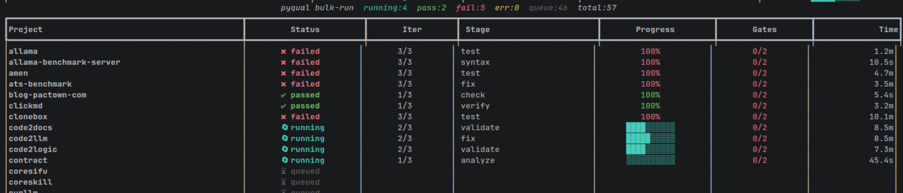

# pyqual

## AI Cost Tracking

   
  

- 🤖 **LLM usage:** $7.5000 (199 commits)
- 👤 **Human dev:** ~$7484 (74.8h @ $100/h, 30min dedup)

Generated on 2026-04-04 using [openrouter/qwen/qwen3-coder-next](https://openrouter.ai/qwen/qwen3-coder-next)

---

<!-- pyqual:badges:start -->
     
           
<!-- pyqual:badges:end -->


---

**Declarative quality gate loops for AI-assisted development.**

One YAML file. One command. Pipeline iterates until your code meets quality thresholds.

```bash
pip install pyqual
pyqual init
pyqual run
```

## The problem

You use Copilot, Claude, GPT. They generate code. But nobody checks if that code meets your quality standards before it hits code review. And nobody automatically iterates if it doesn't.

pyqual closes that gap: define metrics → run tools → check gates → if fail, LLM fixes → re-check → repeat until pass.

## How it works

```
pyqual.yaml defines everything:
    ┌─────────────────────────────────────────┐
    │  metrics:                               │
    │    cc_max: 15        ← quality gates    │
    │    vallm_pass_min: 90                   │
    │    coverage_min: 80                     │
    │                                         │
    │  stages:                                │
    │    - analyze  (code2llm)                │
    │    - validate (vallm)                   │
    │    - fix      (llx/aider, when: fail)   │
    │    - test     (pytest)                  │
    │                                         │
    │  loop:                                  │
    │    max_iterations: 3                    │
    │    on_fail: report                      │
    └─────────────────────────────────────────┘

pyqual run:
    Iteration 1 → analyze → validate → fix → test → check gates
                                                         │
                                              ┌── PASS ──┴── FAIL ──┐
                                              │                     │
                                           Done ✅          Iteration 2...
```

## pyqual.yaml

```yaml
pipeline:
  name: quality-loop

  metrics:
    cc_max: 15           # cyclomatic complexity per function
    vallm_pass_min: 90   # vallm validation pass rate (%)
    coverage_min: 80     # test coverage (%)

  stages:
    - name: analyze
      run: code2llm ./ -f toon,evolution

    - name: validate
      run: vallm batch ./ --recursive --errors-json > .pyqual/errors.json

    - name: fix
      run: llx fix . --errors .pyqual/errors.json
      when: metrics_fail    # only runs if gates fail
      timeout: 300          # seconds (optional)
      optional: false       # if true, failure is allowed

    - name: test
      run: pytest --cov --cov-report=json:.pyqual/coverage.json
      when: always          # always | metrics_fail | metrics_pass

  loop:
    max_iterations: 3
    on_fail: report         # report | create_ticket | block
```

### Stage options

| Field | Type | Default | Description |
|-------|------|---------|-------------|
| `name` | string | required | Stage identifier |
| `run` | string | — | Shell command to execute |
| `tool` | string | — | Built-in tool preset (alternative to `run`) |
| `when` | string | `always` | `always`, `metrics_fail`, `metrics_pass` |
| `timeout` | int | 0 | Seconds (0 = no limit) |
| `optional` | bool | `false` | Allow failure without failing the pipeline (only skips if command doesn't exist) |

### Loop options

| Field | Type | Default | Description |
|-------|------|---------|-------------|
| `max_iterations` | int | `3` | Maximum loop count |
| `on_fail` | string | `report` | `report` — print summary; `create_ticket` — sync TODO.md via planfile; `block` — exit non-zero immediately |

## CLI

### `pyqual init`

```bash
pyqual init [PATH]
```

Create `pyqual.yaml` with sensible defaults in `PATH` (default: current directory).

---

### `pyqual run`

```bash
pyqual run [OPTIONS]

Options:
  -c, --config PATH     Config file  [default: pyqual.yaml]
  -w, --workdir PATH    Working directory  [default: .]
  -n, --dry-run         Preview pipeline without executing stages
  -v, --verbose         Show live pipeline log to stderr
```

Execute the full quality-gate loop. Exits non-zero if gates are not met.

```bash
pyqual run
pyqual run --config my-config.yaml --workdir ./src
pyqual run --dry-run          # preview which stages would run
pyqual run --verbose          # show stage output live
```

---

### `pyqual gates`

```bash
pyqual gates [OPTIONS]

Options:
  -c, --config PATH     Config file  [default: pyqual.yaml]
  -w, --workdir PATH    Working directory  [default: .]
```

Check quality gates against currently collected metrics without running any stages. Useful after a manual tool run.

---

### `pyqual tune`

```bash
pyqual tune [OPTIONS]

Options:
  -a, --aggressive      More ambitious thresholds (90% of current)
  -c, --conservative    Safer thresholds with margin (120% of current)
  -d, --dry-run         Show changes without applying
  -f, --config PATH     Config file  [default: pyqual.yaml]
```

Auto-tune quality gate thresholds based on collected metrics from recent pipeline runs. Analyzes current values and suggests optimal thresholds for `cc_max`, `vallm_pass_min`, `coverage_min`, and `secrets_found_max`.

```bash
pyqual tune --dry-run          # Preview suggested changes
pyqual tune --aggressive       # Apply tighter thresholds
pyqual tune --conservative     # Apply safer thresholds
```

---

### `pyqual status`

```bash
pyqual status [OPTIONS]

Options:
  -c, --config PATH     Config file  [default: pyqual.yaml]
  -w, --workdir PATH    Working directory  [default: .]
```

Show pipeline config summary and all metrics currently found in `.pyqual/`.

---

### `pyqual logs`

```bash
pyqual logs [OPTIONS]

Options:
  -w, --workdir PATH    Working directory  [default: .]
  -n, --tail INT        Show last N entries (0 = all)  [default: 0]
  -l, --level TEXT      Filter by event type: stage_done, gate_check,
                        pipeline_start, pipeline_end
  -f, --failed          Show only failed stages/gates
  -j, --json            Raw JSON lines (ideal for LLM/llx consumption)
      --sql TEXT        Run arbitrary SQL against pipeline.db (advanced)
```

View structured pipeline logs from `.pyqual/pipeline.db` (written by `nfo` during every run).

```bash
pyqual logs                            # all entries
pyqual logs --tail 20                  # last 20
pyqual logs --failed                   # only failures
pyqual logs --level gate_check         # only gate results
pyqual logs --json --failed            # JSON failures for LLM
pyqual logs --sql "SELECT * FROM pipeline_logs WHERE level='WARNING'"
```

---

### `pyqual bulk-init`

```bash
pyqual bulk-init PATH [OPTIONS]

Options:
  -n, --dry-run         Preview without writing files
      --no-llm          Heuristic classification only (no LLM calls)
  -m, --model TEXT      Override LLM model for classification
      --overwrite       Regenerate even if pyqual.yaml already exists
      --show-schema     Print JSON schema used for LLM classification and exit
  -j, --json            Output results as JSON
```

Auto-generate `pyqual.yaml` for every subdirectory in a workspace. Detects project type (Python, Node.js, PHP, Rust, Go, shell, mixed) via LLM classification with JSON schema or heuristic fallback. Never overwrites unless `--overwrite`.

```bash
pyqual bulk-init /path/to/workspace
pyqual bulk-init /path/to/workspace --dry-run
pyqual bulk-init /path/to/workspace --no-llm
pyqual bulk-init /path/to/workspace --overwrite
pyqual bulk-init /path/to/workspace --show-schema
```

---

### `pyqual bulk-run`

```bash
pyqual bulk-run PATH [OPTIONS]

Options:
  -p, --parallel INT    Max concurrent pyqual processes  [default: 4]
  -n, --dry-run         Pass --dry-run to each project run
  -t, --timeout INT     Per-project timeout in seconds (0 = no limit)  [default: 0]
  -f, --filter TEXT     Only run matching project names (repeatable)
      --no-live         Disable live dashboard, print final summary only
  -v, --verbose         Show last output line per project in dashboard
  -j, --json            Output final results as JSON
```

Run `pyqual` across all projects in a workspace with a real-time dashboard.

```bash
pyqual bulk-run /path/to/workspace
pyqual bulk-run /path/to/workspace --parallel 8
pyqual bulk-run /path/to/workspace --filter mylib --filter webapp
pyqual bulk-run /path/to/workspace --timeout 600
pyqual bulk-run /path/to/workspace --no-live           # CI mode, no dashboard
pyqual bulk-run /path/to/workspace --json              # JSON output
```

**Live dashboard:**

```
pyqual bulk-run  running:3  pass:12  fail:1  err:0  queue:43  total:59
┏━━━━━━━━━━━━━━┳━━━━━━━━━━━━┳━━━━━━━┳━━━━━━━━━━┳━━━━━━━━━━━━┳━━━━━━━┳━━━━━━┓
┃Project       ┃  Status    ┃ Iter  ┃ Stage    ┃  Progress  ┃ Gates ┃ Time ┃
┡━━━━━━━━━━━━━━╇━━━━━━━━━━━━╇━━━━━━━╇━━━━━━━━━━╇━━━━━━━━━━━━╇━━━━━━━╇━━━━━━┩
│aidesk        │ ✅ passed  │  2/3  │          │   100%     │  2/2  │12.3s │
│allama        │ 🔄 running  │  1/3  │ validate │ ████░░░░░░ │  0/2  │ 8.5s │
│blog-pactown  │ ❌ failed  │  3/3  │          │    60%     │  1/2  │45.2s │
│…             │ ⏳ queued  │       │          │            │       │      │
└──────────────┴────────────┴───────┴──────────┴────────────┴───────┴──────┘
```

---

### `pyqual mcp-fix`

```bash
pyqual mcp-fix [OPTIONS]

Options:
  -w, --workdir PATH        Project directory on the host  [default: .]
      --project-path TEXT   Path as seen by the MCP service container
      --issues PATH         Gate-failure JSON  [default: .pyqual/errors.json]
      --output PATH         Report output path  [default: .pyqual/llx_mcp.json]
      --endpoint TEXT       MCP SSE endpoint URL
      --model TEXT          Override the model selected by llx
      --file TEXT           File to focus on (repeatable)
      --use-docker          Run aider inside Docker
      --docker-arg TEXT     Extra Docker arguments (repeatable)
      --task TEXT           Analysis task hint for llx  [default: quick_fix]
      --json                Print full JSON result
```

Run the llx-backed MCP fix workflow. Reads `.pyqual/errors.json`, sends issues to an MCP SSE service, and writes the result to `.pyqual/llx_mcp.json`.

Requires `pip install pyqual[mcp]`. Set `PYQUAL_LLX_MCP_URL` or pass `--endpoint`.

```bash
pyqual mcp-fix
pyqual mcp-fix --workdir . --project-path /workspace/project
pyqual mcp-fix --issues .pyqual/errors.json --model claude-3-5-sonnet
pyqual mcp-fix --file src/main.py --file src/utils.py
pyqual mcp-fix --json   # machine-readable result
```

---

### `pyqual mcp-refactor`

```bash
pyqual mcp-refactor [OPTIONS]
```

Same options as `mcp-fix` (except no `--task`). Runs the refactor workflow instead of the fix workflow.

---

### `pyqual mcp-service`

```bash
pyqual mcp-service [OPTIONS]

Options:
  --host TEXT   Host interface to bind to  [default: 0.0.0.0]
  --port INT    Port to listen on  [default: 8000]
```

Start the persistent llx MCP SSE service with `/health` and `/metrics` endpoints. Requires `pip install pyqual[mcp]`.

---

### `pyqual tickets`

```bash
pyqual tickets todo    [OPTIONS]   # sync TODO.md via planfile markdown backend
pyqual tickets github  [OPTIONS]   # sync GitHub Issues via planfile GitHub backend
pyqual tickets all     [OPTIONS]   # sync both

Common options:
  -w, --workdir PATH    Repository root  [default: .]
      --dry-run         Preview without changing files
      --direction TEXT  from | to | both  [default: both]
```

Planfile-backed ticket management. When `on_fail: create_ticket` is set, pyqual automatically calls `tickets todo` after a failed run.

```bash
pyqual tickets todo --dry-run                  # preview
pyqual tickets github --direction to           # push to GitHub
pyqual tickets all --direction from            # pull from all backends
```

Requires `planfile` (included). For GitHub: set `GITHUB_TOKEN`.

See [`examples/ticket_workflow/`](examples/ticket_workflow/) for a complete example.

---

### `pyqual plugin`

```bash
pyqual plugin list    [--tag TAG]          # list available plugins
pyqual plugin search  QUERY               # search by name/description/tag
pyqual plugin info    NAME                # show details + YAML snippet
pyqual plugin add     NAME [--workdir .]  # append config to pyqual.yaml
pyqual plugin remove  NAME [--workdir .]  # remove config from pyqual.yaml
pyqual plugin validate     [--workdir .]  # check configured plugins
```

Manage built-in metric collector plugins.

```bash
pyqual plugin list
pyqual plugin list --tag security
pyqual plugin search llm
pyqual plugin info llx-mcp-fixer
pyqual plugin add security
pyqual plugin remove llm-bench
```

**Built-in plugins:**

| Name | Tags | Metrics produced |
|------|------|-----------------|
| `llm-bench` | llm, benchmark | `pass_at_1`, `code_bleu`, `ai_generated_pct` |
| `hallucination` | llm, rag | `faithfulness_score`, `hallucination_rate`, `prompt_token_efficiency` |
| `sbom` | security, compliance | `sbom_coverage`, `vuln_supply_chain` |
| `i18n` | i18n, l10n | `i18n_coverage`, `i18n_missing` |
| `a11y` | accessibility | `a11y_issues`, `a11y_critical` |
| `repo-metrics` | git, health | `bus_factor`, `commit_frequency`, `contributor_diversity` |
| `security` | security, secrets | `secrets_found`, `vuln_critical`, `vuln_total` |
| `llx-mcp-fixer` | mcp, llx, fix | `llx_fix_success`, `llx_fix_returncode`, `llx_tool_calls` |

See [`examples/custom_plugins/`](examples/custom_plugins/) for building your own.

---

### `pyqual doctor`

```bash
pyqual doctor
```

Check availability of all external tools (bandit, mypy, ruff, pylint, flake8, radon, interrogate, vulture, pytest, trufflehog, gitleaks, docker, code2llm, vallm, uvicorn). Prints install commands for missing tools.

---

### `pyqual tools`

```bash
pyqual tools
```

List all built-in tool presets that can be used as `tool:` shortcuts in pipeline stages (e.g., `tool: ruff`, `tool: pytest`, `tool: code2llm`).

## Python API

```python
from pyqual import Pipeline, PyqualConfig

config = PyqualConfig.load("pyqual.yaml")
pipeline = Pipeline(config, workdir="./my-project")
result = pipeline.run()

if result.final_passed:
    print(f"All gates passed in {result.iteration_count} iterations")
else:
    print("Gates not met — check result.iterations for details")
    for it in result.iterations:
        for gate in it.gates:
            print(f"  {gate}")
```

Check gates without running stages:

```python
from pyqual import PyqualConfig, GateSet

config = PyqualConfig.load("pyqual.yaml")
results = GateSet(config.gates).check_all()
for r in results:
    print("✅" if r.passed else "❌", r)
```

See [`examples/basic/`](examples/basic/) for more API patterns.

## LLM Integration

pyqual includes built-in LLM support via [liteLLM](https://litellm.ai/). Configure via `.env`:

The convenience wrapper lives upstream in `llx.llm`; `pyqual` re-exports it so existing imports keep working.

```bash
OPENROUTER_API_KEY=sk-or-v1-...
LLM_MODEL=openrouter/qwen/qwen3-coder-next
```

```python
from pyqual import get_llm

llm = get_llm()
response = llm.complete("Explain Python decorators")
print(response.content)
print(f"Cost: ${response.cost:.4f}")
```

See [`examples/llx/`](examples/llx/) for a full LLM-backed pipeline.

## Docker-backed MCP fixer/refactor

The MCP client, service, workflow orchestration (`LlxMcpRunResult`, `run_llx_fix_workflow`, `run_llx_refactor_workflow`), issue parsing, and prompt building live in the upstream `llx` package (≥ 0.1.47). pyqual re-exports them for backward compatibility. Install `pyqual[mcp]` to enable.

```bash
docker compose -f examples/llm_fix/docker-compose.yml up --build -d
pyqual plugin add llx-mcp-fixer
pyqual run
```

The plugin writes results to `.pyqual/llx_mcp.json`, gated via `llx_fix_*` metrics.

```bash
# Run workflows directly
pyqual mcp-fix --workdir . --project-path /workspace/project
pyqual mcp-refactor --workdir . --project-path /workspace/project

# Run standalone service
pyqual mcp-service --host 0.0.0.0 --port 8000
```

Set `PYQUAL_LLX_MCP_URL` to point clients at the service. See [`examples/llm_fix/`](examples/llm_fix/) for a complete Docker Compose setup.

## Metric sources

pyqual automatically collects from `.toon` files and `.pyqual/` artifacts:

| Source | File | Metrics |
|--------|------|---------|
| **Analysis** | `project/analysis.toon.yaml` | `cc` (CC̄), `critical` |
| **Validation** | `project/validation.toon.yaml` | `vallm_pass` |
| | `.pyqual/errors.json` | `error_count` |
| **Coverage** | `.pyqual/coverage.json` | `coverage` |
| **Performance** | `.pyqual/asv.json` | `bench_regression`, `bench_time` |
| | `.pyqual/mem.json` | `mem_usage`, `cpu_time` |
| **Security** | `.pyqual/bandit.json` | `bandit_high`, `bandit_medium`, `bandit_low` |
| | `.pyqual/secrets.json` | `secrets_severity`, `secrets_count` |
| | `.pyqual/vulns.json` | `vuln_critical`, `vuln_count` |
| | `.pyqual/sbom.json` | `sbom_compliance`, `license_blacklist` |
| **Project health** | `.pyqual/vulture.json` | `unused_count` |
| | `.pyqual/pyroma.json` | `pyroma_score` |
| | `.pyqual/git_metrics.json` | `git_branch_age`, `todo_count` |
| **LLM / AI** | `.pyqual/humaneval.json` | `llm_pass_rate` |
| | `.pyqual/llm_analysis.json` | `llm_cc`, `hallucination_rate`, `prompt_bias_score`, `agent_efficiency` |
| | `.pyqual/llx_mcp.json` | `llx_fix_success`, `llx_fix_returncode`, `llx_tool_calls`, `llx_fix_tier_rank` |
| | `.pyqual/costs.json` | `ai_cost` |
| **Linting** | `.pyqual/ruff.json` | `ruff_errors`, `ruff_fatal`, `ruff_warnings` |
| | `.pyqual/pylint.json` | `pylint_errors`, `pylint_fatal`, `pylint_error`, `pylint_warnings`, `pylint_score` |
| | `.pyqual/flake8.json` | `flake8_violations`, `flake8_errors`, `flake8_warnings`, `flake8_conventions` |
| | `.pyqual/mypy.json` | `mypy_errors` |
| **Documentation** | `.pyqual/interrogate.json` | `docstring_coverage`, `docstring_total`, `docstring_missing` |

Custom metrics: subclass `MetricCollector` and register with `PluginRegistry` — see [`examples/custom_plugins/`](examples/custom_plugins/).

## Gate operators

Metric key suffixes translate to comparison operators:

```yaml
metrics:
  cc_max: 15           # cc ≤ 15
  coverage_min: 80     # coverage ≥ 80
  critical_max: 0      # critical ≤ 0
  error_count_max: 5   # error_count ≤ 5
  vallm_pass_min: 90   # vallm_pass ≥ 90
  mypy_errors_eq: 0    # mypy_errors = 0
```

| Suffix | Operator |
|--------|----------|
| `_max` | ≤ |
| `_min` | ≥ |
| `_lt` | < |
| `_gt` | > |
| `_eq` | = |

## Integration with ecosystem

pyqual orchestrates — it does not implement the analysis tools:

- **[code2llm](https://github.com/wronai/code2llm)** — code analysis → pyqual reads `.toon` output
- **[vallm](https://github.com/wronai/vallm)** — AI validation → pyqual reads pass rates
- **[llx](https://github.com/wronai/llx)** — LLM routing, MCP workflows, issue parsing (requires Python ≥ 3.10)
- **[planfile](https://github.com/wronai/planfile)** — ticket management → pyqual syncs TODO.md and GitHub Issues
- **costs** — AI spend tracking → pyqual can gate on `ai_cost`
- **algitex** — imports pyqual as a dependency for its `go` command

## Examples

See [`examples/`](examples/) for ready-to-use configurations.

### Basics

| Example | Description |
|---------|-------------|
| [`basic/`](examples/basic/) | Python API — Pipeline, GateSet, minimal one-liner |
| [`python-package/`](examples/python-package/) | Standard Python package (src-layout) |
| [`python-flat/`](examples/python-flat/) | Flat project without src/ |
| [`monorepo/`](examples/monorepo/) | Multiple packages in one repository |

### Quality & Linting

| Example | Tools |
|---------|-------|
| [`linters/`](examples/linters/) | ruff, pylint, flake8, mypy, interrogate |
| [`security/`](examples/security/) | bandit, pip-audit, trufflehog, gitleaks, sbom |
| [`custom_gates/`](examples/custom_gates/) | Dynamic thresholds, composite scoring |
| [`custom_plugins/`](examples/custom_plugins/) | Build your own `MetricCollector` plugins |

### AI & LLM

| Example | Description |
|---------|-------------|
| [`llx/`](examples/llx/) | Standalone llx integration — model auto-selection |
| [`llm_fix/`](examples/llm_fix/) | Docker-backed llx MCP fix workflow |

### CI/CD

| Example | Platform |
|---------|----------|
| [`github-actions/`](examples/github-actions/) | GitHub Actions — PR checks, artifacts, coverage |
| [`gitlab-ci/`](examples/gitlab-ci/) | GitLab CI — coverage reports, caching |

### Advanced

| Example | Key Feature |
|---------|-------------|
| [`multi_gate_pipeline/`](examples/multi_gate_pipeline/) | 21-gate production pipeline (linters + security + AI + testing) |
| [`ticket_workflow/`](examples/ticket_workflow/) | Auto TODO.md + GitHub Issues on gate failure |
| [`project_analysis/`](examples/project_analysis/) | Gating on code2llm / toon analysis metrics |

## Why not add this to algitex?

algitex has 29,448 lines, CC̄=3.6, 64 critical issues, vallm pass 42.8%. Adding more features makes it worse. pyqual does one thing well: declarative quality gate loops. algitex imports pyqual. Both improve.

## License

Licensed under Apache-2.0.
