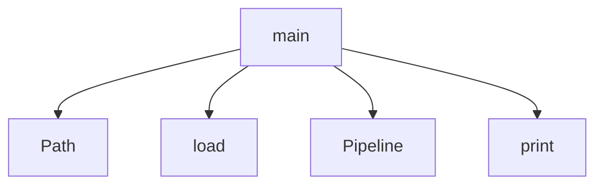

# System Architecture Analysis

## Overview

- **Project**: /home/tom/github/semcod/pyqual/examples/multi_gate_pipeline
- **Primary Language**: python
- **Languages**: python: 1
- **Analysis Mode**: static
- **Total Functions**: 2
- **Total Classes**: 0
- **Modules**: 1
- **Entry Points**: 1

## Architecture by Module

### run_pipeline
- **Functions**: 2
- **File**: `run_pipeline.py`

## Key Entry Points

Main execution flows into the system:

### run_pipeline.main
- **Calls**: Path, PyqualConfig.load, Pipeline, print, print, print, print, print

## Process Flows

Key execution flows identified:

### Flow 1: main
```
main [run_pipeline]
```

## Data Transformation Functions

Key functions that process and transform data:

## Public API Surface

Functions exposed as public API (no underscore prefix):

- `run_pipeline.main` - 30 calls
- `run_pipeline.build_report` - 4 calls

## System Interactions

How components interact:



## Reverse Engineering Guidelines

1. **Entry Points**: Start analysis from the entry points listed above
2. **Core Logic**: Focus on classes with many methods
3. **Data Flow**: Follow data transformation functions
4. **Process Flows**: Use the flow diagrams for execution paths
5. **API Surface**: Public API functions reveal the interface

## Context for LLM

Maintain the identified architectural patterns and public API surface when suggesting changes.