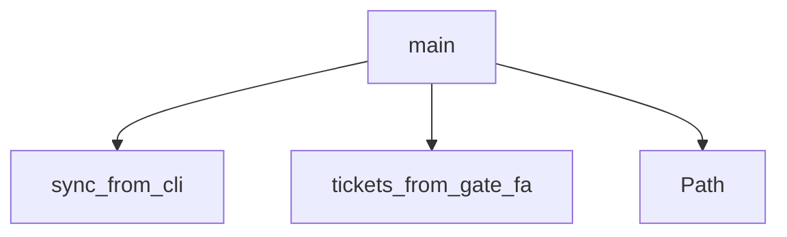

# System Architecture Analysis

## Overview

- **Project**: /home/tom/github/semcod/pyqual/examples/ticket_workflow
- **Primary Language**: python
- **Languages**: python: 1
- **Analysis Mode**: static
- **Total Functions**: 3
- **Total Classes**: 0
- **Modules**: 1
- **Entry Points**: 1

## Architecture by Module

### sync_tickets
- **Functions**: 3
- **File**: `sync_tickets.py`

## Key Entry Points

Main execution flows into the system:

### sync_tickets.main
- **Calls**: sync_tickets.sync_from_cli, sync_tickets.tickets_from_gate_failures, Path

## Process Flows

Key execution flows identified:

### Flow 1: main
```
main [sync_tickets]
  └─> sync_from_cli
  └─> tickets_from_gate_failures
```

## Data Transformation Functions

Key functions that process and transform data:

## Public API Surface

Functions exposed as public API (no underscore prefix):

- `sync_tickets.tickets_from_gate_failures` - 12 calls
- `sync_tickets.sync_from_cli` - 10 calls
- `sync_tickets.main` - 3 calls

## System Interactions

How components interact:



## Reverse Engineering Guidelines

1. **Entry Points**: Start analysis from the entry points listed above
2. **Core Logic**: Focus on classes with many methods
3. **Data Flow**: Follow data transformation functions
4. **Process Flows**: Use the flow diagrams for execution paths
5. **API Surface**: Public API functions reveal the interface

## Context for LLM

Maintain the identified architectural patterns and public API surface when suggesting changes.