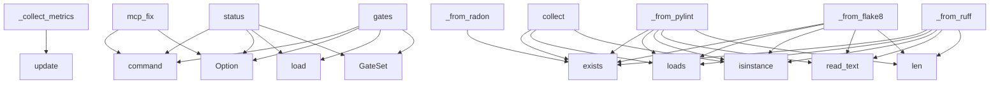

# System Architecture Analysis

## Overview

- **Project**: /home/tom/github/semcod/pyqual
- **Primary Language**: python
- **Languages**: python: 14, shell: 2
- **Analysis Mode**: static
- **Total Functions**: 117
- **Total Classes**: 27
- **Modules**: 16
- **Entry Points**: 93

## Architecture by Module

### pyqual.gates
- **Functions**: 30
- **Classes**: 3
- **File**: `gates.py`

### pyqual.plugins
- **Functions**: 24
- **Classes**: 11
- **File**: `plugins.py`

### pyqual.cli
- **Functions**: 15
- **File**: `cli.py`

### pyqual.integrations.llx_mcp_service
- **Functions**: 15
- **Classes**: 1
- **File**: `llx_mcp_service.py`

### pyqual.integrations.llx_mcp
- **Functions**: 13
- **Classes**: 2
- **File**: `llx_mcp.py`

### pyqual.llm
- **Functions**: 7
- **Classes**: 2
- **File**: `llm.py`

### pyqual.pipeline
- **Functions**: 7
- **Classes**: 4
- **File**: `pipeline.py`

### pyqual.config
- **Functions**: 6
- **Classes**: 4
- **File**: `config.py`

### examples.llx.demo
- **Functions**: 1
- **File**: `demo.sh`

## Key Entry Points

Main execution flows into the system:

### pyqual.cli.mcp_fix
> Run the llx-backed MCP fix workflow.
- **Calls**: app.command, typer.Option, typer.Option, typer.Option, typer.Option, typer.Option, typer.Option, typer.Option

### pyqual.gates.GateSet._collect_metrics
> Collect metrics from .pyqual/ artifacts and .toon files.
- **Calls**: metrics.update, metrics.update, metrics.update, metrics.update, metrics.update, metrics.update, metrics.update, metrics.update

### pyqual.gates.GateSet._from_pylint
> Extract pylint score and error counts from JSON output.
- **Calls**: p.exists, json.loads, isinstance, p.read_text, len, sum, sum, sum

### pyqual.gates.GateSet._from_flake8
> Extract flake8 violation count from JSON output.
- **Calls**: p.exists, json.loads, isinstance, p.read_text, len, sum, sum, sum

### pyqual.plugins.SecurityCollector.collect
- **Calls**: path.exists, path.exists, json.loads, isinstance, json.loads, sum, float, float

### pyqual.gates.GateSet._from_ruff
> Extract ruff linter error counts from JSON output.
- **Calls**: p.exists, json.loads, isinstance, p.read_text, len, sum, sum, float

### pyqual.cli.status
> Show current metrics and pipeline config.
- **Calls**: app.command, typer.Option, typer.Option, PyqualConfig.load, GateSet, gate_set._collect_metrics, console.print, console.print

### pyqual.cli.gates
> Check quality gates without running stages.
- **Calls**: app.command, typer.Option, typer.Option, PyqualConfig.load, GateSet, gate_set.check_all, Table, table.add_column

### pyqual.gates.GateSet._from_radon
> Extract maintainability index and complexity from radon JSON.
- **Calls**: p.exists, json.loads, p.read_text, isinstance, v.get, float, float, isinstance

### pyqual.cli.run
> Execute pipeline loop until quality gates pass.
- **Calls**: app.command, typer.Option, typer.Option, typer.Option, PyqualConfig.load, Pipeline, pipeline.run, console.print

### pyqual.plugins.LLMBenchCollector.collect
- **Calls**: humaneval_path.exists, codebleu_path.exists, json.loads, json.loads, humaneval_path.read_text, data.get, data.get, float

### pyqual.integrations.llx_mcp.main
> CLI entry point used by pyqual pipeline stages.
- **Calls**: pyqual.integrations.llx_mcp.build_parser, parser.parse_args, None.resolve, Path, Path, asyncio.run, print, str

### pyqual.gates.GateSet._from_vulnerabilities
> Extract vulnerability metrics from vulns.json.
- **Calls**: vuln_path.exists, json.loads, isinstance, vuln_path.read_text, sum, float, float, isinstance

### pyqual.cli.doctor
> Check availability of external tools used by pyqual collectors.
- **Calls**: app.command, Table, table.add_column, table.add_column, table.add_column, table.add_column, console.print, console.print

### pyqual.plugins.HallucinationCollector.collect
- **Calls**: hall_path.exists, json.loads, hall_path.read_text, data.get, data.get, float, data.get, data.get

### pyqual.gates.GateSet._from_llm_quality
> Extract LLM code quality metrics from humaneval.json and llm_analysis.json.
- **Calls**: path.exists, json.loads, path.read_text, data.get, data.get, data.get, data.get, data.get

### pyqual.cli.plugin
> Manage pyqual plugins - add, remove, search metric collectors.
- **Calls**: app.command, typer.Argument, typer.Argument, typer.Option, typer.Option, pyqual.plugins.get_available_plugins, Path, pyqual.cli._plugin_list

### pyqual.gates.GateSet._from_safety
> Extract vulnerability counts from pip-audit/safety JSON output.
- **Calls**: p.exists, json.loads, float, float, float, float, float, p.read_text

### pyqual.config.PyqualConfig._parse
- **Calls**: raw.get, pipeline.get, cls, StageConfig, GateConfig.from_dict, LoopConfig, LoopConfig, pipeline.get

### pyqual.gates.GateSet._from_bandit
> Extract security issue counts from bandit JSON output.
- **Calls**: p.exists, json.loads, data.get, sum, sum, sum, float, float

### pyqual.gates.GateSet._from_benchmark
> Extract benchmark metrics from asv.json.
- **Calls**: bench_path.exists, json.loads, bench_path.read_text, isinstance, None.get, None.get, str, data.get

### pyqual.gates.GateSet._from_sbom
> Extract SBOM compliance metrics from sbom.json.
- **Calls**: sbom_path.exists, json.loads, data.get, len, sum, sum, float, sbom_path.read_text

### pyqual.gates.GateSet._from_pyroma
> Extract packaging quality from pyroma.json.
- **Calls**: pyr_path.exists, json.loads, isinstance, pyr_path.read_text, data.get, data.get, float, isinstance

### pyqual.plugins.RepoMetricsCollector.collect
- **Calls**: path.exists, json.loads, path.read_text, data.get, data.get, float, data.get, data.get

### pyqual.gates.GateSet._from_interrogate
> Extract docstring coverage from interrogate JSON output.
- **Calls**: p.exists, json.loads, p.read_text, data.get, data.get, float, data.get, data.get

### pyqual.cli.init
> Create pyqual.yaml with sensible defaults.
- **Calls**: app.command, typer.Argument, target.exists, target.write_text, None.mkdir, console.print, console.print, Path

### pyqual.plugins.LlxMcpFixCollector._collect_analysis_metrics
- **Calls**: analysis.get, isinstance, analysis.get, isinstance, isinstance, self._assign_float, self._assign_float, self._tier_rank

### pyqual.plugins.LlxMcpFixCollector._collect_aider_metrics
- **Calls**: aider.get, self._assign_float, aider.get, self._count_lines, self._count_lines, isinstance, aider.get, aider.get

### pyqual.gates.GateSet._from_vallm
> Extract vallm pass rate from validation_toon.yaml or errors.json.
- **Calls**: errors_path.exists, p.read_text, re.search, p.exists, float, json.loads, isinstance, pass_match.group

### pyqual.gates.GateSet._from_secrets
> Extract secrets scan metrics from secrets.json.
- **Calls**: sec_path.exists, json.loads, isinstance, sec_path.read_text, float, float, None.lower, max

## Process Flows

Key execution flows identified:

### Flow 1: mcp_fix
```
mcp_fix [pyqual.cli]
```

### Flow 2: _collect_metrics
```
_collect_metrics [pyqual.gates.GateSet]
```

### Flow 3: _from_pylint
```
_from_pylint [pyqual.gates.GateSet]
```

### Flow 4: _from_flake8
```
_from_flake8 [pyqual.gates.GateSet]
```

### Flow 5: collect
```
collect [pyqual.plugins.SecurityCollector]
```

### Flow 6: _from_ruff
```
_from_ruff [pyqual.gates.GateSet]
```

### Flow 7: status
```
status [pyqual.cli]
```

### Flow 8: gates
```
gates [pyqual.cli]
```

### Flow 9: _from_radon
```
_from_radon [pyqual.gates.GateSet]
```

### Flow 10: run
```
run [pyqual.cli]
```

## Key Classes

### pyqual.gates.GateSet
> Collection of quality gates with metric collection.
- **Methods**: 28
- **Key Methods**: pyqual.gates.GateSet.__init__, pyqual.gates.GateSet.check_all, pyqual.gates.GateSet.all_passed, pyqual.gates.GateSet._collect_metrics, pyqual.gates.GateSet._from_toon, pyqual.gates.GateSet._from_vallm, pyqual.gates.GateSet._from_coverage, pyqual.gates.GateSet._from_safety, pyqual.gates.GateSet._from_bandit, pyqual.gates.GateSet._from_secrets

### pyqual.integrations.llx_mcp_service.McpServiceState
> Runtime state exposed via health and metrics endpoints.
- **Methods**: 9
- **Key Methods**: pyqual.integrations.llx_mcp_service.McpServiceState.mark_request, pyqual.integrations.llx_mcp_service.McpServiceState.mark_session_open, pyqual.integrations.llx_mcp_service.McpServiceState.mark_session_close, pyqual.integrations.llx_mcp_service.McpServiceState.mark_message, pyqual.integrations.llx_mcp_service.McpServiceState.mark_error, pyqual.integrations.llx_mcp_service.McpServiceState.uptime_seconds, pyqual.integrations.llx_mcp_service.McpServiceState.last_activity_seconds_ago, pyqual.integrations.llx_mcp_service.McpServiceState.health_payload, pyqual.integrations.llx_mcp_service.McpServiceState.metrics_text

### pyqual.plugins.LlxMcpFixCollector
> Dockerized llx MCP fixer workflow results.
- **Methods**: 8
- **Key Methods**: pyqual.plugins.LlxMcpFixCollector._tier_rank, pyqual.plugins.LlxMcpFixCollector._load_report, pyqual.plugins.LlxMcpFixCollector._assign_float, pyqual.plugins.LlxMcpFixCollector._count_lines, pyqual.plugins.LlxMcpFixCollector._collect_analysis_metrics, pyqual.plugins.LlxMcpFixCollector._collect_aider_metrics, pyqual.plugins.LlxMcpFixCollector.get_config_example, pyqual.plugins.LlxMcpFixCollector.collect
- **Inherits**: MetricCollector

### pyqual.pipeline.Pipeline
> Execute pipeline stages in a loop until quality gates pass.
- **Methods**: 7
- **Key Methods**: pyqual.pipeline.Pipeline.__init__, pyqual.pipeline.Pipeline.run, pyqual.pipeline.Pipeline.check_gates, pyqual.pipeline.Pipeline._run_iteration, pyqual.pipeline.Pipeline._should_run_stage, pyqual.pipeline.Pipeline._execute_stage, pyqual.pipeline.Pipeline._ensure_pyqual_dir

### pyqual.integrations.llx_mcp.LlxMcpClient
> Thin MCP client for the llx SSE service.
- **Methods**: 6
- **Key Methods**: pyqual.integrations.llx_mcp.LlxMcpClient.__init__, pyqual.integrations.llx_mcp.LlxMcpClient._session, pyqual.integrations.llx_mcp.LlxMcpClient._extract_text_payload, pyqual.integrations.llx_mcp.LlxMcpClient.call_tool, pyqual.integrations.llx_mcp.LlxMcpClient.analyze, pyqual.integrations.llx_mcp.LlxMcpClient.fix_with_aider

### pyqual.config.PyqualConfig
> Full pyqual.yaml configuration.
- **Methods**: 4
- **Key Methods**: pyqual.config.PyqualConfig.load, pyqual.config.PyqualConfig.llm_model, pyqual.config.PyqualConfig._parse, pyqual.config.PyqualConfig.default_yaml

### pyqual.plugins.PluginRegistry
> Registry for metric collector plugins.
- **Methods**: 4
- **Key Methods**: pyqual.plugins.PluginRegistry.register, pyqual.plugins.PluginRegistry.get, pyqual.plugins.PluginRegistry.list_plugins, pyqual.plugins.PluginRegistry.create_instance

### pyqual.llm.LLM
> LiteLLM wrapper with .env configuration.
- **Methods**: 3
- **Key Methods**: pyqual.llm.LLM.__init__, pyqual.llm.LLM.complete, pyqual.llm.LLM.fix_code

### pyqual.plugins.MetricCollector
> Base class for metric collector plugins.

Subclasses should implement collect() to extract metrics f
- **Methods**: 2
- **Key Methods**: pyqual.plugins.MetricCollector.collect, pyqual.plugins.MetricCollector.get_config_example
- **Inherits**: ABC

### pyqual.config.GateConfig
> Single quality gate threshold.
- **Methods**: 1
- **Key Methods**: pyqual.config.GateConfig.from_dict

### pyqual.plugins.PluginMetadata
> Metadata for a pyqual plugin.
- **Methods**: 1
- **Key Methods**: pyqual.plugins.PluginMetadata.__post_init__

### pyqual.plugins.LLMBenchCollector
> LLM code generation quality metrics from human-eval and CodeBLEU.
- **Methods**: 1
- **Key Methods**: pyqual.plugins.LLMBenchCollector.collect
- **Inherits**: MetricCollector

### pyqual.plugins.HallucinationCollector
> Hallucination detection and prompt quality metrics.
- **Methods**: 1
- **Key Methods**: pyqual.plugins.HallucinationCollector.collect
- **Inherits**: MetricCollector

### pyqual.plugins.SBOMCollector
> SBOM compliance and supply chain security metrics.
- **Methods**: 1
- **Key Methods**: pyqual.plugins.SBOMCollector.collect
- **Inherits**: MetricCollector

### pyqual.plugins.I18nCollector
> Internationalization coverage metrics.
- **Methods**: 1
- **Key Methods**: pyqual.plugins.I18nCollector.collect
- **Inherits**: MetricCollector

### pyqual.plugins.A11yCollector
> Accessibility (a11y) compliance metrics.
- **Methods**: 1
- **Key Methods**: pyqual.plugins.A11yCollector.collect
- **Inherits**: MetricCollector

### pyqual.plugins.RepoMetricsCollector
> Advanced repository health metrics (bus factor, diversity).
- **Methods**: 1
- **Key Methods**: pyqual.plugins.RepoMetricsCollector.collect
- **Inherits**: MetricCollector

### pyqual.plugins.SecurityCollector
> Security scanning metrics from trufflehog, gitleaks, safety.
- **Methods**: 1
- **Key Methods**: pyqual.plugins.SecurityCollector.collect
- **Inherits**: MetricCollector

### pyqual.integrations.llx_mcp.LlxMcpRunResult
> Result of an llx MCP fix workflow.
- **Methods**: 1
- **Key Methods**: pyqual.integrations.llx_mcp.LlxMcpRunResult.to_dict

### pyqual.gates.GateResult
> Result of a single gate check.
- **Methods**: 1
- **Key Methods**: pyqual.gates.GateResult.__str__

## Data Transformation Functions

Key functions that process and transform data:

### pyqual.config.PyqualConfig._parse
- **Output to**: raw.get, pipeline.get, cls, StageConfig, GateConfig.from_dict

### pyqual.cli._plugin_validate
- **Output to**: config_path.read_text, console.print, console.print, set, set

### pyqual.integrations.llx_mcp.build_parser
> Build the CLI parser for the llx MCP helper.
- **Output to**: argparse.ArgumentParser, parser.add_argument, parser.add_argument, parser.add_argument, parser.add_argument

### pyqual.integrations.llx_mcp_service.build_parser
> Build the CLI parser for the MCP service.
- **Output to**: argparse.ArgumentParser, parser.add_argument, parser.add_argument, os.getenv, int

## Behavioral Patterns

### state_machine_McpServiceState
- **Type**: state_machine
- **Confidence**: 0.70
- **Functions**: pyqual.integrations.llx_mcp_service.McpServiceState.mark_request, pyqual.integrations.llx_mcp_service.McpServiceState.mark_session_open, pyqual.integrations.llx_mcp_service.McpServiceState.mark_session_close, pyqual.integrations.llx_mcp_service.McpServiceState.mark_message, pyqual.integrations.llx_mcp_service.McpServiceState.mark_error

## Public API Surface

Functions exposed as public API (no underscore prefix):

- `pyqual.cli.mcp_fix` - 42 calls
- `pyqual.integrations.llx_mcp_service.create_app` - 28 calls
- `pyqual.integrations.llx_mcp.run_llx_fix_workflow` - 27 calls
- `pyqual.plugins.SecurityCollector.collect` - 23 calls
- `pyqual.cli.status` - 21 calls
- `pyqual.cli.gates` - 20 calls
- `pyqual.cli.run` - 18 calls
- `pyqual.plugins.LLMBenchCollector.collect` - 18 calls
- `pyqual.integrations.llx_mcp.main` - 18 calls
- `pyqual.cli.doctor` - 17 calls
- `pyqual.integrations.llx_mcp.build_parser` - 16 calls
- `pyqual.plugins.HallucinationCollector.collect` - 15 calls
- `pyqual.cli.plugin` - 14 calls
- `pyqual.plugins.RepoMetricsCollector.collect` - 12 calls
- `pyqual.integrations.llx_mcp.build_fix_prompt` - 12 calls
- `pyqual.cli.init` - 11 calls
- `pyqual.integrations.llx_mcp_service.McpServiceState.metrics_text` - 11 calls
- `pyqual.plugins.SBOMCollector.collect` - 10 calls
- `pyqual.plugins.LlxMcpFixCollector.collect` - 10 calls
- `pyqual.plugins.I18nCollector.collect` - 9 calls
- `pyqual.plugins.A11yCollector.collect` - 9 calls
- `pyqual.llm.LLM.complete` - 8 calls
- `pyqual.config.GateConfig.from_dict` - 7 calls
- `pyqual.config.PyqualConfig.load` - 7 calls
- `pyqual.cli.mcp_service` - 6 calls
- `pyqual.integrations.llx_mcp.LlxMcpClient.call_tool` - 6 calls
- `pyqual.pipeline.Pipeline.run` - 6 calls
- `pyqual.integrations.llx_mcp_service.build_parser` - 6 calls
- `pyqual.llm.LLM.fix_code` - 5 calls
- `pyqual.plugins.install_plugin_config` - 5 calls
- `pyqual.gates.Gate.check` - 5 calls
- `pyqual.llm.get_llm_model` - 3 calls
- `pyqual.gates.GateSet.check_all` - 3 calls
- `pyqual.gates.GateSet.all_passed` - 3 calls
- `pyqual.integrations.llx_mcp_service.McpServiceState.health_payload` - 3 calls
- `pyqual.integrations.llx_mcp_service.run_server` - 3 calls
- `pyqual.integrations.llx_mcp_service.main` - 3 calls
- `pyqual.llm.get_api_key` - 2 calls
- `pyqual.plugins.PluginRegistry.list_plugins` - 2 calls
- `pyqual.plugins.PluginRegistry.create_instance` - 2 calls

## System Interactions

How components interact:



## Reverse Engineering Guidelines

1. **Entry Points**: Start analysis from the entry points listed above
2. **Core Logic**: Focus on classes with many methods
3. **Data Flow**: Follow data transformation functions
4. **Process Flows**: Use the flow diagrams for execution paths
5. **API Surface**: Public API functions reveal the interface

## Context for LLM

Maintain the identified architectural patterns and public API surface when suggesting changes.