# System Architecture Analysis

## Overview

- **Project**: /home/tom/github/semcod/pyqual
- **Primary Language**: python
- **Languages**: python: 28, shell: 2
- **Analysis Mode**: static
- **Total Functions**: 159
- **Total Classes**: 34
- **Modules**: 30
- **Entry Points**: 101

## Architecture by Module

### pyqual.cli
- **Functions**: 30
- **File**: `cli.py`

### pyqual._gate_collectors
- **Functions**: 21
- **File**: `_gate_collectors.py`

### pyqual.builtin_collectors
- **Functions**: 15
- **Classes**: 8
- **File**: `builtin_collectors.py`

### pyqual.pipeline
- **Functions**: 13
- **Classes**: 4
- **File**: `pipeline.py`

### pyqual.tools
- **Functions**: 9
- **Classes**: 1
- **File**: `tools.py`

### pyqual.plugins
- **Functions**: 9
- **Classes**: 3
- **File**: `plugins.py`

### pyqual.bulk_init
- **Functions**: 7
- **Classes**: 3
- **File**: `bulk_init.py`

### pyqual.bulk_run
- **Functions**: 7
- **Classes**: 3
- **File**: `bulk_run.py`

### pyqual.config
- **Functions**: 6
- **Classes**: 4
- **File**: `config.py`

### pyqual.gates
- **Functions**: 6
- **Classes**: 3
- **File**: `gates.py`

### pyqual.tickets
- **Functions**: 6
- **File**: `tickets.py`

### examples.custom_gates.metric_history
- **Functions**: 5
- **File**: `metric_history.py`

### pyqual.validation
- **Functions**: 4
- **Classes**: 3
- **File**: `validation.py`

### pyqual.integrations.llx_mcp_service
- **Functions**: 4
- **File**: `llx_mcp_service.py`

### examples.ticket_workflow.sync_tickets
- **Functions**: 3
- **File**: `sync_tickets.py`

### run_analysis
- **Functions**: 2
- **File**: `run_analysis.py`

### pyqual.integrations.llx_mcp
- **Functions**: 2
- **File**: `llx_mcp.py`

### examples.custom_gates.composite_gates
- **Functions**: 2
- **File**: `composite_gates.py`

### examples.custom_plugins.performance_collector
- **Functions**: 2
- **Classes**: 1
- **File**: `performance_collector.py`

### examples.multi_gate_pipeline.run_pipeline
- **Functions**: 2
- **File**: `run_pipeline.py`

## Key Entry Points

Main execution flows into the system:

### pyqual.cli.bulk_run_cmd
> Run pyqual across all projects with a real-time dashboard.

Discovers all subdirectories of PATH that contain pyqual.yaml and runs
``pyqual run`` in e
- **Calls**: app.command, typer.Argument, typer.Option, typer.Option, typer.Option, typer.Option, typer.Option, typer.Option

### pyqual.cli.fix_config
> Use LLM to auto-repair pyqual.yaml based on project structure.

Scans the project (language, available tools, test framework) and asks the
LLM to prod
- **Calls**: app.command, typer.Option, typer.Option, typer.Option, typer.Option, None.resolve, pyqual.validation.validate_config, pyqual.validation.detect_project_facts

### pyqual.cli.logs
> View structured pipeline logs from .pyqual/pipeline.db (nfo SQLite).

Logs are written via nfo to SQLite during every pipeline run.
Use --json for mac
- **Calls**: app.command, typer.Option, typer.Option, typer.Option, typer.Option, typer.Option, typer.Option, pyqual.cli._query_nfo_db

### pyqual.cli.bulk_init_cmd
> Bulk-generate pyqual.yaml for every project in a directory.

Scans each subdirectory of PATH, detects the project type (via LLM or
heuristics), and ge
- **Calls**: app.command, typer.Argument, typer.Option, typer.Option, typer.Option, typer.Option, typer.Option, typer.Option

### examples.multi_gate_pipeline.run_pipeline.main
- **Calls**: Path, PyqualConfig.load, Pipeline, print, print, print, print, print

### examples.custom_gates.metric_history.main
> Run the metric history self-test with synthetic history.
- **Calls**: tempfile.TemporaryDirectory, Path, pyqual_dir.mkdir, print, print, print, print, sorted

### pyqual._gate_collectors._from_flake8
> Extract flake8 violation count from JSON output.
- **Calls**: p.exists, json.loads, isinstance, p.read_text, len, sum, sum, sum

### pyqual.cli.run
> Execute pipeline loop until quality gates pass.
- **Calls**: app.command, typer.Option, typer.Option, typer.Option, typer.Option, pyqual.cli._setup_logging, PyqualConfig.load, Pipeline

### pyqual.config.PyqualConfig._parse
- **Calls**: raw.get, pyqual.tools.load_entry_point_presets, pipeline.get, pipeline.get, pipeline.get, cls, pyqual.tools.register_custom_tools_from_yaml, StageConfig

### pyqual.builtin_collectors.SecurityCollector.collect
- **Calls**: path.exists, path.exists, json.loads, isinstance, json.loads, sum, float, float

### pyqual._gate_collectors._from_ruff
> Extract ruff linter error counts from JSON output.
- **Calls**: p.exists, json.loads, isinstance, p.read_text, len, sum, sum, float

### pyqual.cli.validate
> Validate pyqual.yaml without running the pipeline.

Checks for:
- YAML parse errors
- Unknown or missing tool binaries
- Gate metric names that no col
- **Calls**: app.command, typer.Option, typer.Option, typer.Option, pyqual.validation.validate_config, console.print, console.print, len

### pyqual.cli.status
> Show current metrics and pipeline config.
- **Calls**: app.command, typer.Option, typer.Option, PyqualConfig.load, GateSet, gate_set._collect_metrics, console.print, console.print

### pyqual.cli.gates
> Check quality gates without running stages.
- **Calls**: app.command, typer.Option, typer.Option, PyqualConfig.load, GateSet, gate_set.check_all, Table, table.add_column

### pyqual.cli.tools
> List built-in tool presets for pipeline stages.
- **Calls**: app.command, Table, table.add_column, table.add_column, table.add_column, table.add_column, table.add_column, sorted

### pyqual.cli.mcp_fix
> Run the llx-backed MCP fix workflow.
- **Calls**: app.command, typer.Option, typer.Option, typer.Option, typer.Option, typer.Option, typer.Option, typer.Option

### pyqual.builtin_collectors.LLMBenchCollector.collect
- **Calls**: humaneval_path.exists, codebleu_path.exists, json.loads, json.loads, humaneval_path.read_text, data.get, data.get, float

### pyqual._gate_collectors._from_vulnerabilities
> Extract vulnerability metrics from vulns.json.
- **Calls**: vuln_path.exists, json.loads, isinstance, vuln_path.read_text, sum, float, float, isinstance

### pyqual.integrations.llx_mcp.main
> CLI entry point used by pyqual pipeline stages.
- **Calls**: pyqual.integrations.llx_mcp.build_parser, parser.parse_args, None.resolve, Path, Path, asyncio.run, print, str

### pyqual.cli.mcp_refactor
> Run the llx-backed MCP refactor workflow.
- **Calls**: app.command, typer.Option, typer.Option, typer.Option, typer.Option, typer.Option, typer.Option, typer.Option

### pyqual.cli.doctor
> Check availability of external tools used by pyqual collectors.
- **Calls**: app.command, Table, table.add_column, table.add_column, table.add_column, table.add_column, console.print, console.print

### examples.custom_gates.composite_gates.run_composite_check
> Run individual gates + composite score on a workdir.
- **Calls**: GateSet, gate_set.check_all, gate_set._collect_metrics, examples.custom_gates.composite_gates.compute_composite_score, print, print, print, print

### pyqual.pipeline.Pipeline._execute_stage
> Execute a single stage command.
- **Calls**: log.info, time.monotonic, self._log_stage, self._resolve_tool_stage, StageResult, self._log_stage, self.on_stage_start, subprocess.run

### pyqual._gate_collectors._from_pylint
> Extract pylint score and error counts from JSON output.
- **Calls**: isinstance, p.exists, json.loads, float, pyqual._gate_collectors._count_pylint_by_type, pyqual._gate_collectors._count_pylint_by_type, pyqual._gate_collectors._count_pylint_by_type, isinstance

### examples.custom_plugins.code_health_collector.CodeHealthCollector.collect
- **Calls**: float, float, float, float, max, max, max, min

### pyqual.builtin_collectors.HallucinationCollector.collect
- **Calls**: hall_path.exists, json.loads, hall_path.read_text, data.get, data.get, float, data.get, data.get

### pyqual._gate_collectors._from_llm_quality
> Extract LLM code quality metrics from humaneval.json and llm_analysis.json.
- **Calls**: path.exists, json.loads, path.read_text, data.get, data.get, data.get, data.get, data.get

### pyqual.pipeline.Pipeline.run
> Run the full pipeline loop.
- **Calls**: PipelineResult, time.monotonic, self._log_event, log.info, range, self._log_event, log.info, len

### pyqual.cli.plugin
> Manage pyqual plugins - add, remove, search metric collectors.
- **Calls**: app.command, typer.Argument, typer.Argument, typer.Option, typer.Option, pyqual.plugins.get_available_plugins, Path, pyqual.cli._plugin_list

### pyqual._gate_collectors._from_bandit
> Extract security issue counts from bandit JSON output.
- **Calls**: p.exists, json.loads, data.get, sum, sum, sum, float, float

## Process Flows

Key execution flows identified:

### Flow 1: bulk_run_cmd
```
bulk_run_cmd [pyqual.cli]
```

### Flow 2: fix_config
```
fix_config [pyqual.cli]
```

### Flow 3: logs
```
logs [pyqual.cli]
```

### Flow 4: bulk_init_cmd
```
bulk_init_cmd [pyqual.cli]
```

### Flow 5: main
```
main [examples.multi_gate_pipeline.run_pipeline]
```

### Flow 6: _from_flake8
```
_from_flake8 [pyqual._gate_collectors]
```

### Flow 7: run
```
run [pyqual.cli]
```

### Flow 8: _parse
```
_parse [pyqual.config.PyqualConfig]
  └─ →> load_entry_point_presets
```

### Flow 9: collect
```
collect [pyqual.builtin_collectors.SecurityCollector]
```

### Flow 10: _from_ruff
```
_from_ruff [pyqual._gate_collectors]
```

## Key Classes

### pyqual.pipeline.Pipeline
> Execute pipeline stages in a loop until quality gates pass.
- **Methods**: 13
- **Key Methods**: pyqual.pipeline.Pipeline.__init__, pyqual.pipeline.Pipeline.run, pyqual.pipeline.Pipeline.check_gates, pyqual.pipeline.Pipeline._run_iteration, pyqual.pipeline.Pipeline._should_run_stage, pyqual.pipeline.Pipeline._resolve_tool_stage, pyqual.pipeline.Pipeline._execute_stage, pyqual.pipeline.Pipeline._init_nfo, pyqual.pipeline.Pipeline._nfo_emit, pyqual.pipeline.Pipeline._log_stage

### pyqual.builtin_collectors.LlxMcpFixCollector
> Dockerized llx MCP fix/refactor workflow results.
- **Methods**: 8
- **Key Methods**: pyqual.builtin_collectors.LlxMcpFixCollector._tier_rank, pyqual.builtin_collectors.LlxMcpFixCollector._load_report, pyqual.builtin_collectors.LlxMcpFixCollector._assign_float, pyqual.builtin_collectors.LlxMcpFixCollector._count_lines, pyqual.builtin_collectors.LlxMcpFixCollector._collect_analysis_metrics, pyqual.builtin_collectors.LlxMcpFixCollector._collect_aider_metrics, pyqual.builtin_collectors.LlxMcpFixCollector.get_config_example, pyqual.builtin_collectors.LlxMcpFixCollector.collect
- **Inherits**: MetricCollector

### pyqual.config.PyqualConfig
> Full pyqual.yaml configuration.
- **Methods**: 4
- **Key Methods**: pyqual.config.PyqualConfig.load, pyqual.config.PyqualConfig.llm_model, pyqual.config.PyqualConfig._parse, pyqual.config.PyqualConfig.default_yaml

### pyqual.plugins.PluginRegistry
> Registry for metric collector plugins.
- **Methods**: 4
- **Key Methods**: pyqual.plugins.PluginRegistry.register, pyqual.plugins.PluginRegistry.get, pyqual.plugins.PluginRegistry.list_plugins, pyqual.plugins.PluginRegistry.create_instance

### pyqual.gates.GateSet
> Collection of quality gates with metric collection.
- **Methods**: 4
- **Key Methods**: pyqual.gates.GateSet.__init__, pyqual.gates.GateSet.check_all, pyqual.gates.GateSet.all_passed, pyqual.gates.GateSet._collect_metrics

### pyqual.validation.ValidationResult
> Aggregated result of validating one pyqual.yaml.
- **Methods**: 4
- **Key Methods**: pyqual.validation.ValidationResult.errors, pyqual.validation.ValidationResult.warnings, pyqual.validation.ValidationResult.ok, pyqual.validation.ValidationResult.add

### pyqual.bulk_run.ProjectRunState
> Mutable state for a single project's pyqual run.
- **Methods**: 3
- **Key Methods**: pyqual.bulk_run.ProjectRunState.progress_pct, pyqual.bulk_run.ProjectRunState.elapsed, pyqual.bulk_run.ProjectRunState.gates_label

### pyqual.tools.ToolPreset
> Definition of a built-in tool invocation preset.
- **Methods**: 2
- **Key Methods**: pyqual.tools.ToolPreset.is_available, pyqual.tools.ToolPreset.shell_command

### pyqual.plugins.MetricCollector
> Base class for metric collector plugins.
- **Methods**: 2
- **Key Methods**: pyqual.plugins.MetricCollector.collect, pyqual.plugins.MetricCollector.get_config_example
- **Inherits**: ABC

### examples.custom_plugins.performance_collector.PerformanceCollector
> Collect latency and throughput metrics from load test results.
- **Methods**: 2
- **Key Methods**: examples.custom_plugins.performance_collector.PerformanceCollector.collect, examples.custom_plugins.performance_collector.PerformanceCollector.get_config_example
- **Inherits**: MetricCollector

### examples.custom_plugins.code_health_collector.CodeHealthCollector
> Weighted composite health score from multiple code quality signals.
- **Methods**: 2
- **Key Methods**: examples.custom_plugins.code_health_collector.CodeHealthCollector.collect, examples.custom_plugins.code_health_collector.CodeHealthCollector.get_config_example
- **Inherits**: MetricCollector

### pyqual.config.GateConfig
> Single quality gate threshold.
- **Methods**: 1
- **Key Methods**: pyqual.config.GateConfig.from_dict

### pyqual.plugins.PluginMetadata
> Metadata for a pyqual plugin.
- **Methods**: 1
- **Key Methods**: pyqual.plugins.PluginMetadata.__post_init__

### pyqual.gates.GateResult
> Result of a single gate check.
- **Methods**: 1
- **Key Methods**: pyqual.gates.GateResult.__str__

### pyqual.gates.Gate
> Single quality gate with metric extraction.
- **Methods**: 1
- **Key Methods**: pyqual.gates.Gate.check

### pyqual.builtin_collectors.LLMBenchCollector
> LLM code generation quality metrics from human-eval and CodeBLEU.
- **Methods**: 1
- **Key Methods**: pyqual.builtin_collectors.LLMBenchCollector.collect
- **Inherits**: MetricCollector

### pyqual.builtin_collectors.HallucinationCollector
> Hallucination detection and prompt quality metrics.
- **Methods**: 1
- **Key Methods**: pyqual.builtin_collectors.HallucinationCollector.collect
- **Inherits**: MetricCollector

### pyqual.builtin_collectors.SBOMCollector
> SBOM compliance and supply chain security metrics.
- **Methods**: 1
- **Key Methods**: pyqual.builtin_collectors.SBOMCollector.collect
- **Inherits**: MetricCollector

### pyqual.builtin_collectors.I18nCollector
> Internationalization coverage metrics.
- **Methods**: 1
- **Key Methods**: pyqual.builtin_collectors.I18nCollector.collect
- **Inherits**: MetricCollector

### pyqual.builtin_collectors.A11yCollector
> Accessibility (a11y) compliance metrics.
- **Methods**: 1
- **Key Methods**: pyqual.builtin_collectors.A11yCollector.collect
- **Inherits**: MetricCollector

## Data Transformation Functions

Key functions that process and transform data:

### pyqual.config.PyqualConfig._parse
- **Output to**: raw.get, pyqual.tools.load_entry_point_presets, pipeline.get, pipeline.get, pipeline.get

### pyqual.cli.validate
> Validate pyqual.yaml without running the pipeline.

Checks for:
- YAML parse errors
- Unknown or mis
- **Output to**: app.command, typer.Option, typer.Option, typer.Option, pyqual.validation.validate_config

### pyqual.cli._plugin_validate
- **Output to**: config_path.read_text, console.print, console.print, set, set

### pyqual.cli._format_log_entry_row
> Return (ts, event_name, name, status, details) for one log entry.
- **Output to**: entry.get, entry.get, None.replace, entry.get, entry.get

### pyqual.validation.validate_config
> Validate a pyqual.yaml file and return structured issues.

Does NOT run any stages — this is a stati
- **Output to**: ValidationResult, raw.get, pipeline.get, pipeline.get, metrics_raw.items

### pyqual.integrations.llx_mcp_service.build_parser
> Build the CLI parser for the MCP service.
- **Output to**: argparse.ArgumentParser, parser.add_argument, parser.add_argument, os.getenv, int

### pyqual.integrations.llx_mcp.build_parser
> Build the CLI parser for the llx MCP helper.
- **Output to**: argparse.ArgumentParser, parser.add_argument, parser.add_argument, parser.add_argument, parser.add_argument

### pyqual.bulk_run._parse_output_line
> Parse a line of pyqual run output and update state.
- **Output to**: line.strip, clean.startswith, clean.startswith, None.strip, None.strip

## Behavioral Patterns

### state_machine_ProjectRunState
- **Type**: state_machine
- **Confidence**: 0.70
- **Functions**: pyqual.bulk_run.ProjectRunState.progress_pct, pyqual.bulk_run.ProjectRunState.elapsed, pyqual.bulk_run.ProjectRunState.gates_label

## Public API Surface

Functions exposed as public API (no underscore prefix):

- `pyqual.bulk_init.generate_pyqual_yaml` - 77 calls
- `pyqual.cli.bulk_run_cmd` - 56 calls
- `pyqual.bulk_init.collect_fingerprint` - 51 calls
- `pyqual.cli.fix_config` - 46 calls
- `pyqual.validation.validate_config` - 45 calls
- `pyqual.cli.logs` - 44 calls
- `run_analysis.run_project` - 38 calls
- `pyqual.cli.bulk_init_cmd` - 35 calls
- `examples.multi_gate_pipeline.run_pipeline.main` - 30 calls
- `examples.custom_gates.metric_history.main` - 29 calls
- `pyqual.bulk_init.classify_with_llm` - 26 calls
- `pyqual.cli.run` - 25 calls
- `pyqual.builtin_collectors.SecurityCollector.collect` - 23 calls
- `pyqual.bulk_init.bulk_init` - 22 calls
- `pyqual.bulk_run.bulk_run` - 22 calls
- `pyqual.cli.validate` - 21 calls
- `pyqual.cli.status` - 21 calls
- `pyqual.cli.gates` - 20 calls
- `pyqual.cli.tools` - 19 calls
- `pyqual.cli.mcp_fix` - 18 calls
- `pyqual.builtin_collectors.LLMBenchCollector.collect` - 18 calls
- `pyqual.integrations.llx_mcp.main` - 18 calls
- `pyqual.bulk_run.build_dashboard_table` - 18 calls
- `pyqual.cli.mcp_refactor` - 17 calls
- `pyqual.cli.doctor` - 17 calls
- `examples.custom_gates.composite_gates.run_composite_check` - 17 calls
- `pyqual.integrations.llx_mcp.build_parser` - 16 calls
- `examples.custom_plugins.code_health_collector.CodeHealthCollector.collect` - 16 calls
- `pyqual.tools.load_entry_point_presets` - 15 calls
- `pyqual.builtin_collectors.HallucinationCollector.collect` - 15 calls
- `pyqual.pipeline.Pipeline.run` - 15 calls
- `pyqual.cli.plugin` - 14 calls
- `pyqual.builtin_collectors.RepoMetricsCollector.collect` - 12 calls
- `examples.custom_gates.composite_gates.compute_composite_score` - 12 calls
- `examples.ticket_workflow.sync_tickets.tickets_from_gate_failures` - 12 calls
- `pyqual.cli.init` - 11 calls
- `examples.custom_gates.dynamic_thresholds.main` - 11 calls
- `pyqual.tools.register_custom_tools_from_yaml` - 10 calls
- `pyqual.builtin_collectors.SBOMCollector.collect` - 10 calls
- `pyqual.builtin_collectors.LlxMcpFixCollector.collect` - 10 calls

## System Interactions

How components interact:

```mermaid
graph TD
    bulk_run_cmd --> command
    bulk_run_cmd --> Argument
    bulk_run_cmd --> Option
    fix_config --> command
    fix_config --> Option
    logs --> command
    logs --> Option
    bulk_init_cmd --> command
    bulk_init_cmd --> Argument
    bulk_init_cmd --> Option
    main --> Path
    main --> load
    main --> Pipeline
    main --> print
    main --> TemporaryDirectory
    main --> mkdir
    _from_flake8 --> exists
    _from_flake8 --> loads
    _from_flake8 --> isinstance
    _from_flake8 --> read_text
    _from_flake8 --> len
    run --> command
    run --> Option
    _parse --> get
    _parse --> load_entry_point_pre
    collect --> exists
    collect --> loads
    collect --> isinstance
    _from_ruff --> exists
    _from_ruff --> loads
```



## Reverse Engineering Guidelines

1. **Entry Points**: Start analysis from the entry points listed above
2. **Core Logic**: Focus on classes with many methods
3. **Data Flow**: Follow data transformation functions
4. **Process Flows**: Use the flow diagrams for execution paths
5. **API Surface**: Public API functions reveal the interface

## Context for LLM

Maintain the identified architectural patterns and public API surface when suggesting changes.