# System Architecture Analysis

## Overview

- **Project**: /home/tom/github/semcod/pyqual
- **Primary Language**: python
- **Languages**: python: 11, shell: 1
- **Analysis Mode**: static
- **Total Functions**: 78
- **Total Classes**: 23
- **Modules**: 12
- **Entry Points**: 72

## Architecture by Module

### pyqual.gates
- **Functions**: 37
- **Classes**: 3
- **File**: `gates.py`

### pyqual.plugins
- **Functions**: 16
- **Classes**: 10
- **File**: `plugins.py`

### pyqual.llm
- **Functions**: 7
- **Classes**: 2
- **File**: `llm.py`

### pyqual.pipeline
- **Functions**: 7
- **Classes**: 4
- **File**: `pipeline.py`

### pyqual.cli
- **Functions**: 6
- **File**: `cli.py`

### pyqual.config
- **Functions**: 5
- **Classes**: 4
- **File**: `config.py`

## Key Entry Points

Main execution flows into the system:

### pyqual.cli.plugin
> Manage pyqual plugins - add new metric collectors.
- **Calls**: app.command, typer.Argument, typer.Argument, typer.Option, Path, pyqual.plugins.get_available_plugins, Table, table.add_column

### pyqual.gates.GateSet._collect_metrics
> Collect metrics from .pyqual/ artifacts and .toon files.
- **Calls**: metrics.update, metrics.update, metrics.update, metrics.update, metrics.update, metrics.update, metrics.update, metrics.update

### pyqual.gates.GateSet._from_pylint
> Extract pylint score and error counts from JSON output.
- **Calls**: p.exists, json.loads, isinstance, p.read_text, len, sum, sum, sum

### pyqual.gates.GateSet._from_llm_quality
> Extract LLM code quality metrics from humaneval.json, codebleu.json, and llm_analysis.json.
- **Calls**: path.exists, json.loads, path.read_text, data.get, data.get, float, data.get, data.get

### pyqual.gates.GateSet._from_flake8
> Extract flake8 violation count from JSON output.
- **Calls**: p.exists, json.loads, isinstance, p.read_text, len, sum, sum, sum

### pyqual.plugins.SecurityCollector.collect
- **Calls**: path.exists, path.exists, json.loads, isinstance, json.loads, sum, float, float

### pyqual.gates.GateSet._from_ruff
> Extract ruff linter error counts from JSON output.
- **Calls**: p.exists, json.loads, isinstance, p.read_text, len, sum, sum, float

### pyqual.cli.status
> Show current metrics and pipeline config.
- **Calls**: app.command, typer.Option, typer.Option, PyqualConfig.load, GateSet, gate_set._collect_metrics, console.print, console.print

### pyqual.gates.GateSet._from_a11y
> Extract accessibility metrics from a11y.json.
- **Calls**: a11y_path.exists, json.loads, data.get, float, sum, sum, sum, sum

### pyqual.cli.gates
> Check quality gates without running stages.
- **Calls**: app.command, typer.Option, typer.Option, PyqualConfig.load, GateSet, gate_set.check_all, Table, table.add_column

### pyqual.gates.GateSet._from_radon
> Extract maintainability index and complexity from radon JSON.
- **Calls**: p.exists, json.loads, p.read_text, isinstance, v.get, float, float, isinstance

### pyqual.gates.GateSet._from_hallucination
> Extract hallucination detection metrics from hall.json.
- **Calls**: hall_path.exists, json.loads, data.get, data.get, hall_path.read_text, data.get, data.get, float

### pyqual.cli.run
> Execute pipeline loop until quality gates pass.
- **Calls**: app.command, typer.Option, typer.Option, typer.Option, PyqualConfig.load, Pipeline, pipeline.run, console.print

### pyqual.plugins.LLMBenchCollector.collect
- **Calls**: humaneval_path.exists, codebleu_path.exists, json.loads, json.loads, humaneval_path.read_text, data.get, data.get, float

### pyqual.gates.GateSet._from_vulnerabilities
> Extract vulnerability metrics from vulns.json.
- **Calls**: vuln_path.exists, json.loads, isinstance, vuln_path.read_text, sum, float, float, isinstance

### pyqual.cli.doctor
> Check availability of external tools used by pyqual collectors.
- **Calls**: app.command, Table, table.add_column, table.add_column, table.add_column, table.add_column, console.print, console.print

### pyqual.config.PyqualConfig.load
> Load configuration from YAML file or pyproject.toml.
- **Calls**: pyqual.config._load_env_file, Path, yaml.safe_load, cls._parse, Path, pyproject.exists, FileNotFoundError, p.exists

### pyqual.gates.GateSet._from_repo_advanced
> Extract advanced repository metrics from repo_health.json or grimoirelab output.
- **Calls**: path.exists, json.loads, data.get, path.read_text, data.get, data.get, float, data.get

### pyqual.gates.GateSet._from_import_linter
> Extract import contract violations from import-linter JSON output.
- **Calls**: p.exists, json.loads, data.get, isinstance, p.read_text, data.get, float, float

### pyqual.gates.GateSet._from_isort
> Extract import sorting violations from isort check output.
- **Calls**: p.exists, json.loads, isinstance, p.read_text, len, float, isinstance, isinstance

### pyqual.gates.GateSet._from_sbom
> Extract SBOM compliance metrics from sbom.json.
- **Calls**: sbom_path.exists, json.loads, data.get, len, sum, data.get, float, sum

### pyqual.gates.GateSet._from_pydocstyle
> Extract docstring style violations from pydocstyle JSON output.
- **Calls**: p.exists, json.loads, isinstance, p.read_text, len, float, errors_by_type.items, isinstance

### pyqual.plugins.HallucinationCollector.collect
- **Calls**: hall_path.exists, json.loads, hall_path.read_text, data.get, data.get, float, data.get, data.get

### pyqual.gates.GateSet._from_secrets
> Extract leaked secrets count from trufflehog/gitleaks JSON.
- **Calls**: p.exists, json.loads, isinstance, float, p.read_text, len, isinstance, None.lower

### pyqual.gates.GateSet._from_git_health
> Extract repository health metrics from git_metrics.json.
- **Calls**: git_path.exists, json.loads, data.get, data.get, data.get, git_path.read_text, float, float

### pyqual.gates.GateSet._from_black
> Extract code formatting violations from black check output.
- **Calls**: p.exists, json.loads, isinstance, p.read_text, len, float, isinstance, data.get

### pyqual.gates.GateSet._from_safety
> Extract vulnerability counts from pip-audit/safety JSON output.
- **Calls**: p.exists, json.loads, float, float, float, float, float, p.read_text

### pyqual.gates.GateSet._from_bandit
> Extract security issue counts from bandit JSON output.
- **Calls**: p.exists, json.loads, data.get, sum, sum, sum, float, float

### pyqual.gates.GateSet._from_benchmark
> Extract benchmark metrics from asv.json.
- **Calls**: bench_path.exists, json.loads, bench_path.read_text, isinstance, None.get, None.get, str, data.get

### pyqual.gates.GateSet._from_pyroma
> Extract packaging quality from pyroma.json.
- **Calls**: pyr_path.exists, json.loads, isinstance, pyr_path.read_text, data.get, data.get, float, isinstance

## Process Flows

Key execution flows identified:

### Flow 1: plugin
```
plugin [pyqual.cli]
```

### Flow 2: _collect_metrics
```
_collect_metrics [pyqual.gates.GateSet]
```

### Flow 3: _from_pylint
```
_from_pylint [pyqual.gates.GateSet]
```

### Flow 4: _from_llm_quality
```
_from_llm_quality [pyqual.gates.GateSet]
```

### Flow 5: _from_flake8
```
_from_flake8 [pyqual.gates.GateSet]
```

### Flow 6: collect
```
collect [pyqual.plugins.SecurityCollector]
```

### Flow 7: _from_ruff
```
_from_ruff [pyqual.gates.GateSet]
```

### Flow 8: status
```
status [pyqual.cli]
```

### Flow 9: _from_a11y
```
_from_a11y [pyqual.gates.GateSet]
```

### Flow 10: gates
```
gates [pyqual.cli]
```

## Key Classes

### pyqual.gates.GateSet
> Collection of quality gates with metric collection.
- **Methods**: 35
- **Key Methods**: pyqual.gates.GateSet.__init__, pyqual.gates.GateSet.check_all, pyqual.gates.GateSet.all_passed, pyqual.gates.GateSet._collect_metrics, pyqual.gates.GateSet._from_toon, pyqual.gates.GateSet._from_vallm, pyqual.gates.GateSet._from_coverage, pyqual.gates.GateSet._from_safety, pyqual.gates.GateSet._from_bandit, pyqual.gates.GateSet._from_secrets

### pyqual.pipeline.Pipeline
> Execute pipeline stages in a loop until quality gates pass.
- **Methods**: 7
- **Key Methods**: pyqual.pipeline.Pipeline.__init__, pyqual.pipeline.Pipeline.run, pyqual.pipeline.Pipeline.check_gates, pyqual.pipeline.Pipeline._run_iteration, pyqual.pipeline.Pipeline._should_run_stage, pyqual.pipeline.Pipeline._execute_stage, pyqual.pipeline.Pipeline._ensure_pyqual_dir

### pyqual.config.PyqualConfig
> Full pyqual.yaml configuration.
- **Methods**: 4
- **Key Methods**: pyqual.config.PyqualConfig.load, pyqual.config.PyqualConfig.llm_model, pyqual.config.PyqualConfig._parse, pyqual.config.PyqualConfig.default_yaml

### pyqual.plugins.PluginRegistry
> Registry for metric collector plugins.
- **Methods**: 4
- **Key Methods**: pyqual.plugins.PluginRegistry.register, pyqual.plugins.PluginRegistry.get, pyqual.plugins.PluginRegistry.list_plugins, pyqual.plugins.PluginRegistry.create_instance

### pyqual.llm.LLM
> LiteLLM wrapper with .env configuration.
- **Methods**: 3
- **Key Methods**: pyqual.llm.LLM.__init__, pyqual.llm.LLM.complete, pyqual.llm.LLM.fix_code

### pyqual.plugins.MetricCollector
> Base class for metric collector plugins.

Subclasses should implement collect() to extract metrics f
- **Methods**: 2
- **Key Methods**: pyqual.plugins.MetricCollector.collect, pyqual.plugins.MetricCollector.get_config_example
- **Inherits**: ABC

### pyqual.config.GateConfig
> Single quality gate threshold.
- **Methods**: 1
- **Key Methods**: pyqual.config.GateConfig.from_dict

### pyqual.plugins.PluginMetadata
> Metadata for a pyqual plugin.
- **Methods**: 1
- **Key Methods**: pyqual.plugins.PluginMetadata.__post_init__

### pyqual.plugins.LLMBenchCollector
> LLM code generation quality metrics from human-eval and CodeBLEU.
- **Methods**: 1
- **Key Methods**: pyqual.plugins.LLMBenchCollector.collect
- **Inherits**: MetricCollector

### pyqual.plugins.HallucinationCollector
> Hallucination detection and prompt quality metrics.
- **Methods**: 1
- **Key Methods**: pyqual.plugins.HallucinationCollector.collect
- **Inherits**: MetricCollector

### pyqual.plugins.SBOMCollector
> SBOM compliance and supply chain security metrics.
- **Methods**: 1
- **Key Methods**: pyqual.plugins.SBOMCollector.collect
- **Inherits**: MetricCollector

### pyqual.plugins.I18nCollector
> Internationalization coverage metrics.
- **Methods**: 1
- **Key Methods**: pyqual.plugins.I18nCollector.collect
- **Inherits**: MetricCollector

### pyqual.plugins.A11yCollector
> Accessibility (a11y) compliance metrics.
- **Methods**: 1
- **Key Methods**: pyqual.plugins.A11yCollector.collect
- **Inherits**: MetricCollector

### pyqual.plugins.RepoMetricsCollector
> Advanced repository health metrics (bus factor, diversity).
- **Methods**: 1
- **Key Methods**: pyqual.plugins.RepoMetricsCollector.collect
- **Inherits**: MetricCollector

### pyqual.plugins.SecurityCollector
> Security scanning metrics from trufflehog, gitleaks, safety.
- **Methods**: 1
- **Key Methods**: pyqual.plugins.SecurityCollector.collect
- **Inherits**: MetricCollector

### pyqual.pipeline.StageResult
> Result of running a single stage.
- **Methods**: 1
- **Key Methods**: pyqual.pipeline.StageResult.passed

### pyqual.pipeline.PipelineResult
> Result of the complete pipeline run (all iterations).
- **Methods**: 1
- **Key Methods**: pyqual.pipeline.PipelineResult.iteration_count

### pyqual.gates.GateResult
> Result of a single gate check.
- **Methods**: 1
- **Key Methods**: pyqual.gates.GateResult.__str__

### pyqual.gates.Gate
> Single quality gate with metric extraction.
- **Methods**: 1
- **Key Methods**: pyqual.gates.Gate.check

### pyqual.llm.LLMResponse
> Response from LLM call.
- **Methods**: 0

## Data Transformation Functions

Key functions that process and transform data:

### pyqual.config.PyqualConfig._parse
- **Output to**: raw.get, pipeline.get, cls, StageConfig, GateConfig.from_dict

## Public API Surface

Functions exposed as public API (no underscore prefix):

- `pyqual.cli.plugin` - 55 calls
- `pyqual.plugins.SecurityCollector.collect` - 23 calls
- `pyqual.cli.status` - 21 calls
- `pyqual.cli.gates` - 20 calls
- `pyqual.cli.run` - 18 calls
- `pyqual.plugins.LLMBenchCollector.collect` - 18 calls
- `pyqual.cli.doctor` - 17 calls
- `pyqual.config.PyqualConfig.load` - 17 calls
- `pyqual.plugins.HallucinationCollector.collect` - 15 calls
- `pyqual.plugins.RepoMetricsCollector.collect` - 12 calls
- `pyqual.cli.init` - 11 calls
- `pyqual.plugins.SBOMCollector.collect` - 10 calls
- `pyqual.plugins.I18nCollector.collect` - 9 calls
- `pyqual.plugins.A11yCollector.collect` - 9 calls
- `pyqual.llm.LLM.complete` - 8 calls
- `pyqual.config.GateConfig.from_dict` - 7 calls
- `pyqual.pipeline.Pipeline.run` - 6 calls
- `pyqual.llm.LLM.fix_code` - 5 calls
- `pyqual.plugins.install_plugin_config` - 5 calls
- `pyqual.gates.Gate.check` - 5 calls
- `pyqual.llm.get_llm_model` - 3 calls
- `pyqual.gates.GateSet.check_all` - 3 calls
- `pyqual.gates.GateSet.all_passed` - 3 calls
- `pyqual.llm.get_api_key` - 2 calls
- `pyqual.plugins.PluginRegistry.list_plugins` - 2 calls
- `pyqual.plugins.PluginRegistry.create_instance` - 2 calls
- `pyqual.llm.get_llm` - 1 calls
- `pyqual.plugins.PluginRegistry.get` - 1 calls
- `pyqual.plugins.get_available_plugins` - 1 calls
- `pyqual.pipeline.Pipeline.check_gates` - 1 calls
- `pyqual.config.PyqualConfig.default_yaml` - 0 calls
- `pyqual.plugins.MetricCollector.collect` - 0 calls
- `pyqual.plugins.MetricCollector.get_config_example` - 0 calls
- `pyqual.plugins.PluginRegistry.register` - 0 calls

## System Interactions

How components interact:

```mermaid
graph TD
    plugin --> command
    plugin --> Argument
    plugin --> Option
    plugin --> Path
    _collect_metrics --> update
    _from_pylint --> exists
    _from_pylint --> loads
    _from_pylint --> isinstance
    _from_pylint --> read_text
    _from_pylint --> len
    _from_llm_quality --> exists
    _from_llm_quality --> loads
    _from_llm_quality --> read_text
    _from_llm_quality --> get
    _from_flake8 --> exists
    _from_flake8 --> loads
    _from_flake8 --> isinstance
    _from_flake8 --> read_text
    _from_flake8 --> len
    collect --> exists
    collect --> loads
    collect --> isinstance
    _from_ruff --> exists
    _from_ruff --> loads
    _from_ruff --> isinstance
    _from_ruff --> read_text
    _from_ruff --> len
    status --> command
    status --> Option
    status --> load
```



## Reverse Engineering Guidelines

1. **Entry Points**: Start analysis from the entry points listed above
2. **Core Logic**: Focus on classes with many methods
3. **Data Flow**: Follow data transformation functions
4. **Process Flows**: Use the flow diagrams for execution paths
5. **API Surface**: Public API functions reveal the interface

## Context for LLM

Maintain the identified architectural patterns and public API surface when suggesting changes.