# System Architecture Analysis

## Overview

- **Project**: /home/tom/github/semcod/pyqual
- **Primary Language**: python
- **Languages**: python: 80, typescript: 11, shell: 5, javascript: 2
- **Analysis Mode**: static
- **Total Functions**: 526
- **Total Classes**: 79
- **Modules**: 98
- **Entry Points**: 334

## Architecture by Module

### pyqual.pipeline
- **Functions**: 26
- **Classes**: 10
- **File**: `pipeline.py`

### dashboard.src.api
- **Functions**: 23
- **File**: `index.ts`

### pyqual._gate_collectors
- **Functions**: 22
- **File**: `_gate_collectors.py`

### pyqual.plugins.builtin
- **Functions**: 21
- **Classes**: 9
- **File**: `builtin.py`

### pyqual.plugins.git.main
- **Functions**: 21
- **Classes**: 1
- **File**: `main.py`

### pyqual.cli_run_helpers
- **Functions**: 20
- **File**: `cli_run_helpers.py`

### pyqual.bulk_init
- **Functions**: 19
- **Classes**: 3
- **File**: `bulk_init.py`

### pyqual.report
- **Functions**: 18
- **File**: `report.py`

### pyqual.github_actions
- **Functions**: 16
- **Classes**: 2
- **File**: `github_actions.py`

### pyqual.tools
- **Functions**: 15
- **Classes**: 1
- **File**: `tools.py`

### pyqual.api
- **Functions**: 15
- **Classes**: 1
- **File**: `api.py`

### dashboard.api.main
- **Functions**: 13
- **File**: `main.py`

### pyqual.plugins.docker.main
- **Functions**: 13
- **Classes**: 1
- **File**: `main.py`

### pyqual.plugins.docs.main
- **Functions**: 12
- **Classes**: 1
- **File**: `main.py`

### pyqual.gates
- **Functions**: 11
- **Classes**: 4
- **File**: `gates.py`

### pyqual.documentation
- **Functions**: 11
- **Classes**: 1
- **File**: `documentation.py`

### pyqual.cli_observe
- **Functions**: 11
- **File**: `cli_observe.py`

### pyqual.plugins.security.main
- **Functions**: 11
- **Classes**: 1
- **File**: `main.py`

### pyqual.run_parallel_fix
- **Functions**: 10
- **File**: `run_parallel_fix.py`

### pyqual.plugins.deps.main
- **Functions**: 10
- **Classes**: 1
- **File**: `main.py`

## Key Entry Points

Main execution flows into the system:

### pyqual.cli_observe.register_observe_commands
> Register logs, watch, and history commands onto *app*.
- **Calls**: app.command, app.command, app.command, typer.Option, typer.Option, typer.Option, typer.Option, typer.Option

### pyqual.cli.cmd_run.run
> Execute pipeline loop until quality gates pass.

Output is streamed as YAML to stdout as each stage completes.
Diagnostic messages go to stderr.
- **Calls**: app.command, typer.Option, typer.Option, typer.Option, typer.Option, typer.Option, typer.Option, pyqual.cli.main.setup_logging

### pyqual.cli.cmd_git.git_scan_cmd
> Scan files for secrets before push.

Runs multiple scanners in order:
1. trufflehog (if available) - most comprehensive
2. gitleaks (if available) - f
- **Calls**: git_app.command, typer.Argument, typer.Option, typer.Option, typer.Option, typer.Option, typer.Option, typer.Option

### pyqual.cli.cmd_git.git_push_cmd
> Push commits to remote with push protection detection.
- **Calls**: git_app.command, typer.Option, typer.Option, typer.Option, typer.Option, typer.Option, typer.Option, typer.Option

### pyqual.cli.cmd_config.fix_config
> Use LLM to auto-repair pyqual.yaml based on project structure.

Scans the project (language, available tools, test framework) and asks the
LLM to prod
- **Calls**: app.command, typer.Option, typer.Option, typer.Option, typer.Option, None.resolve, pyqual.api.validate_config, pyqual.validation.detect_project_facts

### pyqual.auto_closer.main
- **Calls**: Path.cwd, gates_info.get, gates_info.get, print, PlanfileStore, store.list_tickets, print, pyqual.auto_closer.get_changed_files

### pyqual.validation.validate_config
> Validate a pyqual.yaml file and return structured issues.

Does NOT run any stages — this is a static pre-flight check.
- **Calls**: ValidationResult, raw.get, pipeline.get, pipeline.get, metrics_raw.items, pipeline.get, config_path.exists, result.add

### pyqual.run_parallel_fix.main
> Run parallel fix on TODO.md items - configurable batch size with git push.
- **Calls**: pyqual.run_parallel_fix.parse_args, Path.cwd, pyqual.run_parallel_fix.get_todo_batch, print, enumerate, batch_file.parent.mkdir, batch_file.write_text, print

### pyqual.cli_log_helpers.format_log_entry_row
> Return (ts, event_name, name, status, details) for one log entry.
- **Calls**: entry.get, entry.get, None.replace, entry.get, entry.get, None.join, entry.get, entry.get

### pyqual.cli.cmd_git.git_status_cmd
> Show git repository status.
- **Calls**: git_app.command, typer.Option, typer.Option, pyqual.plugins.git.main.git_status, console.print, Path, console.print, typer.Exit

### pyqual._gate_collectors._from_vulnerabilities
> Extract vulnerability metrics from vulns.json.
- **Calls**: vuln_path.exists, json.loads, isinstance, vuln_path.read_text, sum, sum, sum, float

### examples.multi_gate_pipeline.run_pipeline.main
- **Calls**: Path, PyqualConfig.load, Pipeline, print, print, print, print, print

### examples.custom_gates.metric_history.main
> Run the metric history self-test with synthetic history.
- **Calls**: tempfile.TemporaryDirectory, Path, pyqual_dir.mkdir, print, print, print, print, sorted

### pyqual.config.PyqualConfig._parse
- **Calls**: raw.get, pyqual.tools.load_entry_point_presets, pyqual.tools.load_user_tools, pipeline.get, pipeline.get, pipeline.get, cls._validate_stages, cls

### pyqual.plugins.docs.main.DocsCollector._collect_readme_metrics
> Extract README quality metrics.
- **Calls**: readme_json_path.exists, readme_path.exists, self._set_zero_readme, json.loads, float, float, float, readme_path.read_text

### pyqual._gate_collectors._from_flake8
> Extract flake8 violation count from JSON output.
- **Calls**: p.exists, json.loads, isinstance, p.read_text, len, sum, sum, sum

### pyqual.parallel.ParallelExecutor.run
> Run all issues across tools in parallel.

Args:
    issues: List of issue strings to process
    group_similar: If True, group similar issues for batc
- **Calls**: time.monotonic, enumerate, len, log.info, sum, sum, sum, log.info

### pyqual.cli.cmd_git.git_commit_cmd
> Create a git commit.
- **Calls**: git_app.command, typer.Option, typer.Option, typer.Option, typer.Option, typer.Option, pyqual.plugins.git.main.git_commit, result.get

### pyqual.cli.cmd_tickets.tickets_sync
> Sync tickets from gate failures or explicitly.

Examples:
    pyqual tickets sync --from-gates              # Check gates, sync if fail
    pyqual tic
- **Calls**: tickets_app.command, typer.Option, typer.Option, typer.Option, typer.Option, Path, console.print, console.print

### pyqual._gate_collectors._from_ruff
> Extract ruff linter error counts from JSON output.
- **Calls**: p.exists, json.loads, isinstance, p.read_text, len, sum, sum, float

### pyqual.cli.cmd_config.status
> Show current metrics and pipeline config.
- **Calls**: app.command, typer.Option, typer.Option, PyqualConfig.load, GateSet, gate_set._collect_metrics, console.print, console.print

### pyqual.pipeline.Pipeline._execute_streaming
> Execute stage with real-time output streaming via Popen.
- **Calls**: subprocess.Popen, proc.wait, StageResult, StageResult, select.select, fd.readline, None.append, None.join

### pyqual.cli.cmd_init.init
> Create pyqual.yaml with sensible defaults.

Use --profile for a minimal config based on a built-in profile:

    pyqual init --profile python         
- **Calls**: app.command, typer.Argument, typer.Option, target.exists, None.mkdir, console.print, console.print, Path

### pyqual.custom_fix.parse_and_apply_suggestions
> Parse LLM suggestions and apply patches.
- **Calls**: re.findall, Path, print, re.search, file_path.exists, print, file_path.read_text, re.search

### pyqual.cli_bulk_cmds.register_bulk_commands
> Register bulk-init and bulk-run commands onto *app*.
- **Calls**: app.command, app.command, typer.Argument, typer.Option, typer.Option, typer.Option, typer.Option, typer.Option

### pyqual.cli.cmd_config.validate
> Validate pyqual.yaml without running the pipeline.

Checks for:
- YAML parse errors
- Unknown or missing tool binaries
- Gate metric names that no col
- **Calls**: app.command, typer.Option, typer.Option, typer.Option, pyqual.api.validate_config, console.print, console.print, len

### pyqual.plugins.deps.main.deps_health_check
> Run comprehensive dependency health check.

Returns aggregated metrics from all dependency checks.
- **Calls**: pyqual.plugins.deps.main.get_outdated_packages, pyqual.plugins.deps.main.get_dependency_tree, pyqual.plugins.deps.main.check_requirements, DepsCollector, collector.collect, outdated.get, Path.cwd, reqs.get

### pyqual.documentation.DocumentationCollector._check_docs_folder
> Check docs/ folder presence and content.
- **Calls**: any, next, float, any, list, len, any, p.exists

### pyqual.cli.cmd_config.gates
> Check quality gates without running stages.
- **Calls**: app.command, typer.Option, typer.Option, PyqualConfig.load, GateSet, gate_set.check_all, Table, table.add_column

### pyqual.plugins.git.main.GitCollector.collect
> Collect git metrics from .pyqual/git_*.json artifacts.
- **Calls**: status_path.exists, push_path.exists, commit_path.exists, scan_path.exists, preflight_path.exists, json.loads, self._collect_status_metrics, json.loads

## Process Flows

Key execution flows identified:

### Flow 1: register_observe_commands
```
register_observe_commands [pyqual.cli_observe]
```

### Flow 2: run
```
run [pyqual.cli.cmd_run]
```

### Flow 3: git_scan_cmd
```
git_scan_cmd [pyqual.cli.cmd_git]
```

### Flow 4: git_push_cmd
```
git_push_cmd [pyqual.cli.cmd_git]
```

### Flow 5: fix_config
```
fix_config [pyqual.cli.cmd_config]
```

### Flow 6: main
```
main [pyqual.auto_closer]
```

### Flow 7: validate_config
```
validate_config [pyqual.validation]
```

### Flow 8: format_log_entry_row
```
format_log_entry_row [pyqual.cli_log_helpers]
```

### Flow 9: git_status_cmd
```
git_status_cmd [pyqual.cli.cmd_git]
  └─ →> git_status
      └─> run_git_command
      └─> run_git_command
```

### Flow 10: _from_vulnerabilities
```
_from_vulnerabilities [pyqual._gate_collectors]
```

## Key Classes

### pyqual.pipeline.Pipeline
> Execute pipeline stages in a loop until quality gates pass.
- **Methods**: 20
- **Key Methods**: pyqual.pipeline.Pipeline.__init__, pyqual.pipeline.Pipeline.run, pyqual.pipeline.Pipeline.check_gates, pyqual.pipeline.Pipeline._run_iteration, pyqual.pipeline.Pipeline._iteration_stagnated, pyqual.pipeline.Pipeline._should_run_stage, pyqual.pipeline.Pipeline._resolve_tool_stage, pyqual.pipeline.Pipeline._resolve_env, pyqual.pipeline.Pipeline._check_optional_binary, pyqual.pipeline.Pipeline._execute_stage

### pyqual.github_actions.GitHubActionsReporter
> Reports pyqual results to GitHub Actions and PRs.
- **Methods**: 14
- **Key Methods**: pyqual.github_actions.GitHubActionsReporter.__init__, pyqual.github_actions.GitHubActionsReporter.create_issue, pyqual.github_actions.GitHubActionsReporter.ensure_issue_exists, pyqual.github_actions.GitHubActionsReporter.is_running_in_github_actions, pyqual.github_actions.GitHubActionsReporter.get_pr_number, pyqual.github_actions.GitHubActionsReporter.fetch_issues, pyqual.github_actions.GitHubActionsReporter.fetch_pull_requests, pyqual.github_actions.GitHubActionsReporter.post_pr_comment, pyqual.github_actions.GitHubActionsReporter.post_issue_comment, pyqual.github_actions.GitHubActionsReporter.close_issue

### pyqual.documentation.DocumentationCollector
> Documentation completeness and quality metrics.

Measures:
- Required files presence (readme, licens
- **Methods**: 11
- **Key Methods**: pyqual.documentation.DocumentationCollector._find_file, pyqual.documentation.DocumentationCollector._check_file_exists, pyqual.documentation.DocumentationCollector._read_pyproject, pyqual.documentation.DocumentationCollector._parse_pyproject_fallback, pyqual.documentation.DocumentationCollector._check_pyproject_metadata, pyqual.documentation.DocumentationCollector._analyze_readme, pyqual.documentation.DocumentationCollector._check_docs_folder, pyqual.documentation.DocumentationCollector._check_required_files, pyqual.documentation.DocumentationCollector._get_docstring_coverage, pyqual.documentation.DocumentationCollector._check_license_type
- **Inherits**: MetricCollector

### pyqual.plugins.docker.main.DockerCollector
> Docker security and quality metrics collector.
- **Methods**: 9
- **Key Methods**: pyqual.plugins.docker.main.DockerCollector.collect, pyqual.plugins.docker.main.DockerCollector._collect_trivy, pyqual.plugins.docker.main.DockerCollector._count_trivy_vulns, pyqual.plugins.docker.main.DockerCollector._set_zero_trivy, pyqual.plugins.docker.main.DockerCollector._collect_hadolint, pyqual.plugins.docker.main.DockerCollector._collect_grype, pyqual.plugins.docker.main.DockerCollector._get_grype_severity, pyqual.plugins.docker.main.DockerCollector._collect_image_info, pyqual.plugins.docker.main.DockerCollector.get_config_example
- **Inherits**: MetricCollector

### pyqual.plugins.builtin.LlxMcpFixCollector
> Dockerized llx MCP fix/refactor workflow results.
- **Methods**: 8
- **Key Methods**: pyqual.plugins.builtin.LlxMcpFixCollector._tier_rank, pyqual.plugins.builtin.LlxMcpFixCollector._load_report, pyqual.plugins.builtin.LlxMcpFixCollector._assign_float, pyqual.plugins.builtin.LlxMcpFixCollector._count_lines, pyqual.plugins.builtin.LlxMcpFixCollector._collect_analysis_metrics, pyqual.plugins.builtin.LlxMcpFixCollector._collect_aider_metrics, pyqual.plugins.builtin.LlxMcpFixCollector.get_config_example, pyqual.plugins.builtin.LlxMcpFixCollector.collect
- **Inherits**: MetricCollector

### pyqual.plugins.security.main.SecurityCollector
> Security metrics collector — aggregates findings from security scanners.
- **Methods**: 7
- **Key Methods**: pyqual.plugins.security.main.SecurityCollector.collect, pyqual.plugins.security.main.SecurityCollector._collect_bandit, pyqual.plugins.security.main.SecurityCollector._collect_audit, pyqual.plugins.security.main.SecurityCollector._get_severity, pyqual.plugins.security.main.SecurityCollector._collect_secrets, pyqual.plugins.security.main.SecurityCollector._collect_safety, pyqual.plugins.security.main.SecurityCollector.get_config_example
- **Inherits**: MetricCollector

### pyqual.plugins.docs.main.DocsCollector
> Documentation quality metrics collector.
- **Methods**: 7
- **Key Methods**: pyqual.plugins.docs.main.DocsCollector.collect, pyqual.plugins.docs.main.DocsCollector._collect_readme_metrics, pyqual.plugins.docs.main.DocsCollector._set_zero_readme, pyqual.plugins.docs.main.DocsCollector._collect_docstring_metrics, pyqual.plugins.docs.main.DocsCollector._collect_link_metrics, pyqual.plugins.docs.main.DocsCollector._collect_changelog_metrics, pyqual.plugins.docs.main.DocsCollector.get_config_example
- **Inherits**: MetricCollector

### pyqual.plugins.git.main.GitCollector
> Git repository operations collector — status, commit, push with protection handling.
- **Methods**: 7
- **Key Methods**: pyqual.plugins.git.main.GitCollector.collect, pyqual.plugins.git.main.GitCollector._collect_scan_metrics, pyqual.plugins.git.main.GitCollector._collect_preflight_metrics, pyqual.plugins.git.main.GitCollector._collect_status_metrics, pyqual.plugins.git.main.GitCollector._collect_push_metrics, pyqual.plugins.git.main.GitCollector._collect_commit_metrics, pyqual.plugins.git.main.GitCollector.get_config_example
- **Inherits**: MetricCollector

### pyqual.gates.GateSet
> Collection of quality gates with metric collection.
- **Methods**: 6
- **Key Methods**: pyqual.gates.GateSet.__init__, pyqual.gates.GateSet._completion_rate, pyqual.gates.GateSet.check_all, pyqual.gates.GateSet.all_passed, pyqual.gates.GateSet.completion_percentage, pyqual.gates.GateSet._collect_metrics

### pyqual.plugins.builtin.SecurityCollector
> Security metrics collector - pip-audit CVEs and ruff lint errors.
- **Methods**: 6
- **Key Methods**: pyqual.plugins.builtin.SecurityCollector.collect, pyqual.plugins.builtin.SecurityCollector._collect_pip_audit, pyqual.plugins.builtin.SecurityCollector._collect_ruff, pyqual.plugins.builtin.SecurityCollector._collect_secrets, pyqual.plugins.builtin.SecurityCollector._collect_mypy, pyqual.plugins.builtin.SecurityCollector.get_config_example
- **Inherits**: MetricCollector

### pyqual.plugins.deps.main.DepsCollector
> Dependency management metrics collector.
- **Methods**: 6
- **Key Methods**: pyqual.plugins.deps.main.DepsCollector.collect, pyqual.plugins.deps.main.DepsCollector._collect_outdated, pyqual.plugins.deps.main.DepsCollector._collect_deptree, pyqual.plugins.deps.main.DepsCollector._collect_requirements, pyqual.plugins.deps.main.DepsCollector._collect_licenses, pyqual.plugins.deps.main.DepsCollector.get_config_example
- **Inherits**: MetricCollector

### pyqual.config.PyqualConfig
> Full pyqual.yaml configuration.
- **Methods**: 5
- **Key Methods**: pyqual.config.PyqualConfig.load, pyqual.config.PyqualConfig.llm_model, pyqual.config.PyqualConfig._parse, pyqual.config.PyqualConfig._validate_stages, pyqual.config.PyqualConfig.default_yaml

### pyqual.fix_tools.base.FixTool
> Abstract base class for fix tools.
- **Methods**: 5
- **Key Methods**: pyqual.fix_tools.base.FixTool.__init__, pyqual.fix_tools.base.FixTool.is_available, pyqual.fix_tools.base.FixTool.get_command, pyqual.fix_tools.base.FixTool.get_timeout, pyqual.fix_tools.base.FixTool.to_config
- **Inherits**: ABC

### pyqual.plugins.attack.main.AttackCollector
> Attack merge collector — automerge with aggressive conflict resolution.
- **Methods**: 5
- **Key Methods**: pyqual.plugins.attack.main.AttackCollector.collect, pyqual.plugins.attack.main.AttackCollector._collect_check_metrics, pyqual.plugins.attack.main.AttackCollector._collect_merge_metrics, pyqual.plugins.attack.main.AttackCollector._strategy_to_int, pyqual.plugins.attack.main.AttackCollector.get_config_example
- **Inherits**: MetricCollector

### pyqual.parallel.ParallelExecutor
> Executes tasks across multiple fix tools in parallel.
- **Methods**: 4
- **Key Methods**: pyqual.parallel.ParallelExecutor.__init__, pyqual.parallel.ParallelExecutor._run_tool_task, pyqual.parallel.ParallelExecutor._tool_worker, pyqual.parallel.ParallelExecutor.run

### pyqual.validation.ValidationResult
> Aggregated result of validating one pyqual.yaml.
- **Methods**: 4
- **Key Methods**: pyqual.validation.ValidationResult.errors, pyqual.validation.ValidationResult.warnings, pyqual.validation.ValidationResult.ok, pyqual.validation.ValidationResult.add

### pyqual.fix_tools.llx.LlxTool
> LLX fix tool.
- **Methods**: 4
- **Key Methods**: pyqual.fix_tools.llx.LlxTool.__init__, pyqual.fix_tools.llx.LlxTool.is_available, pyqual.fix_tools.llx.LlxTool.get_command, pyqual.fix_tools.llx.LlxTool.get_timeout
- **Inherits**: FixTool

### pyqual.plugins._base.PluginRegistry
> Registry for metric collector plugins.
- **Methods**: 4
- **Key Methods**: pyqual.plugins._base.PluginRegistry.register, pyqual.plugins._base.PluginRegistry.get, pyqual.plugins._base.PluginRegistry.list_plugins, pyqual.plugins._base.PluginRegistry.create_instance

### pyqual.gates.CompositeGateSet
> Weighted composite quality scoring from multiple gates.

Example:
    gates = [
        GateConfig(m
- **Methods**: 3
- **Key Methods**: pyqual.gates.CompositeGateSet.__init__, pyqual.gates.CompositeGateSet.compute_score, pyqual.gates.CompositeGateSet.check_composite
- **Inherits**: GateSet

### pyqual.api.ShellHelper
> Shell helper utilities for external tool integration.
- **Methods**: 3
- **Key Methods**: pyqual.api.ShellHelper.run, pyqual.api.ShellHelper.check, pyqual.api.ShellHelper.output

## Data Transformation Functions

Key functions that process and transform data:

### dashboard.api.main.safe_parse
> Parse kwargs from SQLite, handling both JSON and Python repr formats.
- **Output to**: json.loads, ast.literal_eval

### pyqual.custom_fix.parse_and_apply_suggestions
> Parse LLM suggestions and apply patches.
- **Output to**: re.findall, Path, print, re.search, file_path.exists

### pyqual.config.PyqualConfig._parse
- **Output to**: raw.get, pyqual.tools.load_entry_point_presets, pyqual.tools.load_user_tools, pipeline.get, pipeline.get

### pyqual.config.PyqualConfig._validate_stages
> Validate and construct StageConfig list from raw dicts.
- **Output to**: StageConfig, stages.append, StageConfig.__dataclass_fields__.values, ValueError, ValueError

### pyqual.report_generator.parse_kwargs
> Parse kwargs string that might have single quotes.
- **Output to**: json.loads, ast.literal_eval

### pyqual.parallel.parse_todo_items
> Parse unchecked items from TODO.md.
- **Output to**: todo_path.read_text, content.splitlines, todo_path.exists, line.strip, line.startswith

### pyqual.documentation.DocumentationCollector._parse_pyproject_fallback
> Minimal regex parser for pyproject.toml.
- **Output to**: path.read_text, re.search, m.group

### pyqual.api.validate_config
> Validate configuration and return list of errors (empty if valid).
- **Output to**: _validate, str

### pyqual.api.format_result_summary
> Format pipeline result as human-readable summary.

Args:
    result: Pipeline result object
    
Ret
- **Output to**: enumerate, None.join, lines.append, lines.append, lines.append

### pyqual.run_parallel_fix.parse_args
> Parse command line arguments.
- **Output to**: argparse.ArgumentParser, parser.add_argument, parser.add_argument, parser.add_argument, parser.parse_args

### pyqual.bulk_init._validate_yaml_content
> Validate that YAML content is parseable and has required structure.
- **Output to**: yaml.safe_load, ValueError, ValueError

### pyqual.validation.validate_config
> Validate a pyqual.yaml file and return structured issues.

Does NOT run any stages — this is a stati
- **Output to**: ValidationResult, raw.get, pipeline.get, pipeline.get, metrics_raw.items

### pyqual.bulk_run._parse_output_line
> Parse a line of pyqual run output and update state.
- **Output to**: line.strip, clean.startswith, clean.startswith, None.strip, None.strip

### pyqual.cli_run_helpers.format_run_summary
- **Output to**: todo_bits.append, todo_bits.append, todo_bits.append, parts.append, fix_bits.append

### pyqual.cli_log_helpers.format_log_entry_row
> Return (ts, event_name, name, status, details) for one log entry.
- **Output to**: entry.get, entry.get, None.replace, entry.get, entry.get

### pyqual.report._parse_pyproject_fallback
> Minimal regex parser for pyproject.toml when tomllib is unavailable.
- **Output to**: path.read_text, re.search, re.search, m.group, m.group

### pyqual.plugins.cli_helpers.plugin_validate
> Validate that configured plugins in pyqual.yaml are available.
- **Output to**: config_path.read_text, console.print, console.print, set, set

### pyqual.cli.cmd_config.validate
> Validate pyqual.yaml without running the pipeline.

Checks for:
- YAML parse errors
- Unknown or mis
- **Output to**: app.command, typer.Option, typer.Option, typer.Option, pyqual.api.validate_config

### pyqual.integrations.llx_mcp_service.build_parser
> Build the CLI parser for the MCP service.
- **Output to**: argparse.ArgumentParser, parser.add_argument, parser.add_argument, os.getenv, int

### pyqual.integrations.llx_mcp.build_parser
> Build the CLI parser for the llx MCP helper.
- **Output to**: argparse.ArgumentParser, parser.add_argument, parser.add_argument, parser.add_argument, parser.add_argument

## Behavioral Patterns

### state_machine_ProjectRunState
- **Type**: state_machine
- **Confidence**: 0.70
- **Functions**: pyqual.bulk_run.ProjectRunState.progress_pct, pyqual.bulk_run.ProjectRunState.elapsed, pyqual.bulk_run.ProjectRunState.gates_label

## Public API Surface

Functions exposed as public API (no underscore prefix):

- `pyqual.cli_observe.register_observe_commands` - 90 calls
- `pyqual.bulk_init.generate_pyqual_yaml` - 77 calls
- `pyqual.cli.cmd_run.run` - 65 calls
- `pyqual.cli.cmd_git.git_scan_cmd` - 55 calls
- `pyqual.cli.cmd_git.git_push_cmd` - 48 calls
- `pyqual.cli.cmd_config.fix_config` - 46 calls
- `pyqual.auto_closer.main` - 45 calls
- `pyqual.validation.validate_config` - 45 calls
- `pyqual.run_parallel_fix.main` - 44 calls
- `run_analysis.run_project` - 38 calls
- `pyqual.cli_log_helpers.format_log_entry_row` - 38 calls
- `pyqual.cli.cmd_git.git_status_cmd` - 35 calls
- `pyqual.report_generator.get_last_run` - 33 calls
- `examples.multi_gate_pipeline.run_pipeline.main` - 30 calls
- `examples.custom_gates.metric_history.main` - 29 calls
- `pyqual.bulk_init.classify_with_llm` - 26 calls
- `pyqual.parallel.ParallelExecutor.run` - 25 calls
- `pyqual.cli.cmd_git.git_commit_cmd` - 25 calls
- `pyqual.plugins.cli_helpers.plugin_search` - 25 calls
- `pyqual.cli.cmd_tickets.tickets_sync` - 24 calls
- `pyqual.plugins.attack.main.attack_merge` - 24 calls
- `pyqual.cli.cmd_config.status` - 23 calls
- `pyqual.plugins.git.main.scan_for_secrets` - 23 calls
- `pyqual.bulk_run.bulk_run` - 22 calls
- `pyqual.cli.cmd_init.init` - 22 calls
- `pyqual.plugins.git.main.git_push` - 22 calls
- `pyqual.custom_fix.parse_and_apply_suggestions` - 21 calls
- `pyqual.cli_bulk_cmds.register_bulk_commands` - 21 calls
- `pyqual.cli.cmd_config.validate` - 21 calls
- `pyqual.plugins.deps.main.deps_health_check` - 21 calls
- `pyqual.plugins.git.main.preflight_push_check` - 21 calls
- `pyqual.cli_run_helpers.extract_fix_stage_summary` - 20 calls
- `pyqual.cli.cmd_config.gates` - 20 calls
- `pyqual.plugins.git.main.GitCollector.collect` - 20 calls
- `pyqual.plugins.git.main.git_status` - 20 calls
- `pyqual.documentation.DocumentationCollector.collect` - 19 calls
- `pyqual.run_parallel_fix.mark_completed_todos` - 19 calls
- `pyqual.cli.cmd_info.tools` - 19 calls
- `pyqual.plugins.cli_helpers.plugin_list` - 19 calls
- `pyqual.plugins.cli_helpers.plugin_add` - 19 calls

## System Interactions

How components interact:

```mermaid
graph TD
    register_observe_com --> command
    register_observe_com --> Option
    run --> command
    run --> Option
    git_scan_cmd --> command
    git_scan_cmd --> Argument
    git_scan_cmd --> Option
    git_push_cmd --> command
    git_push_cmd --> Option
    fix_config --> command
    fix_config --> Option
    main --> cwd
    main --> get
    main --> print
    main --> PlanfileStore
    validate_config --> ValidationResult
    validate_config --> get
    validate_config --> items
    main --> parse_args
    main --> get_todo_batch
    main --> enumerate
    format_log_entry_row --> get
    format_log_entry_row --> replace
    git_status_cmd --> command
    git_status_cmd --> Option
    git_status_cmd --> git_status
    git_status_cmd --> print
    _from_vulnerabilitie --> exists
    _from_vulnerabilitie --> loads
    _from_vulnerabilitie --> isinstance
```



## Reverse Engineering Guidelines

1. **Entry Points**: Start analysis from the entry points listed above
2. **Core Logic**: Focus on classes with many methods
3. **Data Flow**: Follow data transformation functions
4. **Process Flows**: Use the flow diagrams for execution paths
5. **API Surface**: Public API functions reveal the interface

## Context for LLM

Maintain the identified architectural patterns and public API surface when suggesting changes.