# System Architecture Analysis

## Overview

- **Project**: /home/tom/github/semcod/pyqual
- **Primary Language**: python
- **Languages**: python: 6, shell: 1
- **Analysis Mode**: static
- **Total Functions**: 32
- **Total Classes**: 13
- **Modules**: 7
- **Entry Points**: 28

## Architecture by Module

### pyqual.gates
- **Functions**: 9
- **Classes**: 3
- **File**: `gates.py`

### pyqual.llm
- **Functions**: 7
- **Classes**: 2
- **File**: `llm.py`

### pyqual.pipeline
- **Functions**: 7
- **Classes**: 4
- **File**: `pipeline.py`

### pyqual.config
- **Functions**: 5
- **Classes**: 4
- **File**: `config.py`

### pyqual.cli
- **Functions**: 4
- **File**: `cli.py`

## Key Entry Points

Main execution flows into the system:

### pyqual.cli.status
> Show current metrics and pipeline config.
- **Calls**: app.command, typer.Option, typer.Option, PyqualConfig.load, GateSet, gate_set._collect_metrics, console.print, console.print

### pyqual.cli.gates
> Check quality gates without running stages.
- **Calls**: app.command, typer.Option, typer.Option, PyqualConfig.load, GateSet, gate_set.check_all, Table, table.add_column

### pyqual.cli.run
> Execute pipeline loop until quality gates pass.
- **Calls**: app.command, typer.Option, typer.Option, typer.Option, PyqualConfig.load, Pipeline, pipeline.run, console.print

### pyqual.config.PyqualConfig._parse
- **Calls**: raw.get, pipeline.get, cls, StageConfig, GateConfig.from_dict, LoopConfig, LoopConfig, pipeline.get

### pyqual.cli.init
> Create pyqual.yaml with sensible defaults.
- **Calls**: app.command, typer.Argument, target.exists, target.write_text, None.mkdir, console.print, console.print, Path

### pyqual.pipeline.Pipeline._run_iteration
> Run one iteration of all stages + gate check.
- **Calls**: time.monotonic, IterationResult, self.gate_set.all_passed, self.gate_set.check_all, all, self._should_run_stage, self._execute_stage, iteration.stages.append

### pyqual.gates.GateSet._from_vallm
> Extract vallm pass rate from validation_toon.yaml or errors.json.
- **Calls**: errors_path.exists, p.read_text, re.search, p.exists, float, json.loads, isinstance, pass_match.group

### pyqual.pipeline.Pipeline._execute_stage
> Execute a single stage command.
- **Calls**: time.monotonic, StageResult, subprocess.run, StageResult, StageResult, StageResult, time.monotonic, str

### pyqual.llm.LLM.complete
> Send completion request to LLM.
- **Calls**: messages.append, os.environ.copy, completion, LLMResponse, messages.append, response.usage.dict, hasattr, response._hidden_params.get

### pyqual.gates.GateSet._from_toon
> Extract CC̄ and critical count from analysis_toon.yaml or analysis.toon.
- **Calls**: p.read_text, re.search, re.search, p.exists, float, float, cc_match.group, crit_match.group

### pyqual.config.GateConfig.from_dict
> Parse 'cc_max: 15' or 'coverage_min: 80' into GateConfig.
- **Calls**: ops.items, cls, metric.endswith, cls, float, float, len

### pyqual.config.PyqualConfig.load
> Load configuration from YAML file.
- **Calls**: pyqual.config._load_env_file, Path, yaml.safe_load, cls._parse, p.exists, FileNotFoundError, p.read_text

### pyqual.gates.GateSet._from_coverage
> Extract test coverage from coverage.json.
- **Calls**: cov_path.exists, cov_path.exists, json.loads, None.get, cov_path.read_text, float, data.get

### pyqual.pipeline.Pipeline.run
> Run the full pipeline loop.
- **Calls**: PipelineResult, time.monotonic, range, self._run_iteration, result.iterations.append, time.monotonic

### pyqual.gates.GateSet._collect_metrics
> Collect metrics from .pyqual/ artifacts and .toon files.
- **Calls**: metrics.update, metrics.update, metrics.update, self._from_toon, self._from_vallm, self._from_coverage

### pyqual.llm.LLM.fix_code
> Generate code fix using LLM.
- **Calls**: prompt_parts.append, None.join, self.complete, prompt_parts.append, prompt_parts.append

### pyqual.gates.Gate.check
> Check this gate against collected metrics.
- **Calls**: metrics.get, ops.get, GateResult, GateResult, check_fn

### pyqual.pipeline.Pipeline.__init__
- **Calls**: None.resolve, GateSet, self._ensure_pyqual_dir, Path

### pyqual.llm.LLM.__init__
- **Calls**: pyqual.llm.get_llm_model, pyqual.llm.get_api_key, ImportError

### pyqual.gates.GateSet.check_all
> Collect metrics from known sources and check all gates.
- **Calls**: Path, self._collect_metrics, g.check

### pyqual.gates.GateSet.all_passed
> Return True if all gates pass.
- **Calls**: Path, all, self.check_all

### pyqual.llm.get_llm
> Get configured LLM instance.
- **Calls**: LLM

### pyqual.pipeline.Pipeline.check_gates
> Check quality gates without running stages.
- **Calls**: self.gate_set.check_all

### pyqual.pipeline.Pipeline._ensure_pyqual_dir
> Create .pyqual/ working directory.
- **Calls**: None.mkdir

### pyqual.gates.GateResult.__str__
- **Calls**: op_str.get

### pyqual.gates.GateSet.__init__
- **Calls**: Gate

### pyqual.pipeline.Pipeline._should_run_stage
> Determine if a stage should run based on its 'when' condition.

### pyqual.config.PyqualConfig.default_yaml
> Return default pyqual.yaml content.

## Process Flows

Key execution flows identified:

### Flow 1: status
```
status [pyqual.cli]
```

### Flow 2: gates
```
gates [pyqual.cli]
```

### Flow 3: run
```
run [pyqual.cli]
```

### Flow 4: _parse
```
_parse [pyqual.config.PyqualConfig]
```

### Flow 5: init
```
init [pyqual.cli]
```

### Flow 6: _run_iteration
```
_run_iteration [pyqual.pipeline.Pipeline]
```

### Flow 7: _from_vallm
```
_from_vallm [pyqual.gates.GateSet]
```

### Flow 8: _execute_stage
```
_execute_stage [pyqual.pipeline.Pipeline]
```

### Flow 9: complete
```
complete [pyqual.llm.LLM]
```

### Flow 10: _from_toon
```
_from_toon [pyqual.gates.GateSet]
```

## Key Classes

### pyqual.pipeline.Pipeline
> Execute pipeline stages in a loop until quality gates pass.
- **Methods**: 7
- **Key Methods**: pyqual.pipeline.Pipeline.__init__, pyqual.pipeline.Pipeline.run, pyqual.pipeline.Pipeline.check_gates, pyqual.pipeline.Pipeline._run_iteration, pyqual.pipeline.Pipeline._should_run_stage, pyqual.pipeline.Pipeline._execute_stage, pyqual.pipeline.Pipeline._ensure_pyqual_dir

### pyqual.gates.GateSet
> Collection of quality gates with metric collection.
- **Methods**: 7
- **Key Methods**: pyqual.gates.GateSet.__init__, pyqual.gates.GateSet.check_all, pyqual.gates.GateSet.all_passed, pyqual.gates.GateSet._collect_metrics, pyqual.gates.GateSet._from_toon, pyqual.gates.GateSet._from_vallm, pyqual.gates.GateSet._from_coverage

### pyqual.config.PyqualConfig
> Full pyqual.yaml configuration.
- **Methods**: 4
- **Key Methods**: pyqual.config.PyqualConfig.load, pyqual.config.PyqualConfig.llm_model, pyqual.config.PyqualConfig._parse, pyqual.config.PyqualConfig.default_yaml

### pyqual.llm.LLM
> LiteLLM wrapper with .env configuration.
- **Methods**: 3
- **Key Methods**: pyqual.llm.LLM.__init__, pyqual.llm.LLM.complete, pyqual.llm.LLM.fix_code

### pyqual.pipeline.StageResult
> Result of running a single stage.
- **Methods**: 1
- **Key Methods**: pyqual.pipeline.StageResult.passed

### pyqual.pipeline.PipelineResult
> Result of the complete pipeline run (all iterations).
- **Methods**: 1
- **Key Methods**: pyqual.pipeline.PipelineResult.iteration_count

### pyqual.config.GateConfig
> Single quality gate threshold.
- **Methods**: 1
- **Key Methods**: pyqual.config.GateConfig.from_dict

### pyqual.gates.GateResult
> Result of a single gate check.
- **Methods**: 1
- **Key Methods**: pyqual.gates.GateResult.__str__

### pyqual.gates.Gate
> Single quality gate with metric extraction.
- **Methods**: 1
- **Key Methods**: pyqual.gates.Gate.check

### pyqual.llm.LLMResponse
> Response from LLM call.
- **Methods**: 0

### pyqual.pipeline.IterationResult
> Result of one full pipeline iteration.
- **Methods**: 0

### pyqual.config.StageConfig
> Single pipeline stage.
- **Methods**: 0

### pyqual.config.LoopConfig
> Loop iteration settings.
- **Methods**: 0

## Data Transformation Functions

Key functions that process and transform data:

### pyqual.config.PyqualConfig._parse
- **Output to**: raw.get, pipeline.get, cls, StageConfig, GateConfig.from_dict

## Public API Surface

Functions exposed as public API (no underscore prefix):

- `pyqual.cli.status` - 21 calls
- `pyqual.cli.gates` - 20 calls
- `pyqual.cli.run` - 18 calls
- `pyqual.cli.init` - 11 calls
- `pyqual.llm.LLM.complete` - 8 calls
- `pyqual.config.GateConfig.from_dict` - 7 calls
- `pyqual.config.PyqualConfig.load` - 7 calls
- `pyqual.pipeline.Pipeline.run` - 6 calls
- `pyqual.llm.LLM.fix_code` - 5 calls
- `pyqual.gates.Gate.check` - 5 calls
- `pyqual.llm.get_llm_model` - 3 calls
- `pyqual.gates.GateSet.check_all` - 3 calls
- `pyqual.gates.GateSet.all_passed` - 3 calls
- `pyqual.llm.get_api_key` - 2 calls
- `pyqual.llm.get_llm` - 1 calls
- `pyqual.pipeline.Pipeline.check_gates` - 1 calls
- `pyqual.config.PyqualConfig.default_yaml` - 0 calls

## System Interactions

How components interact:

```mermaid
graph TD
    status --> command
    status --> Option
    status --> load
    status --> GateSet
    gates --> command
    gates --> Option
    gates --> load
    gates --> GateSet
    run --> command
    run --> Option
    run --> load
    _parse --> get
    _parse --> cls
    _parse --> StageConfig
    _parse --> from_dict
    init --> command
    init --> Argument
    init --> exists
    init --> write_text
    init --> mkdir
    _run_iteration --> monotonic
    _run_iteration --> IterationResult
    _run_iteration --> all_passed
    _run_iteration --> check_all
    _run_iteration --> all
    _from_vallm --> exists
    _from_vallm --> read_text
    _from_vallm --> search
    _from_vallm --> float
    _execute_stage --> monotonic
```



## Reverse Engineering Guidelines

1. **Entry Points**: Start analysis from the entry points listed above
2. **Core Logic**: Focus on classes with many methods
3. **Data Flow**: Follow data transformation functions
4. **Process Flows**: Use the flow diagrams for execution paths
5. **API Surface**: Public API functions reveal the interface

## Context for LLM

Maintain the identified architectural patterns and public API surface when suggesting changes.